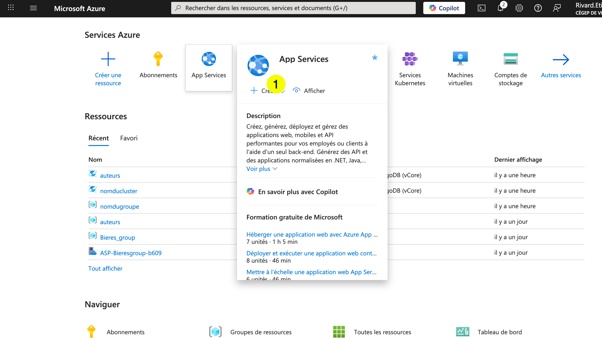
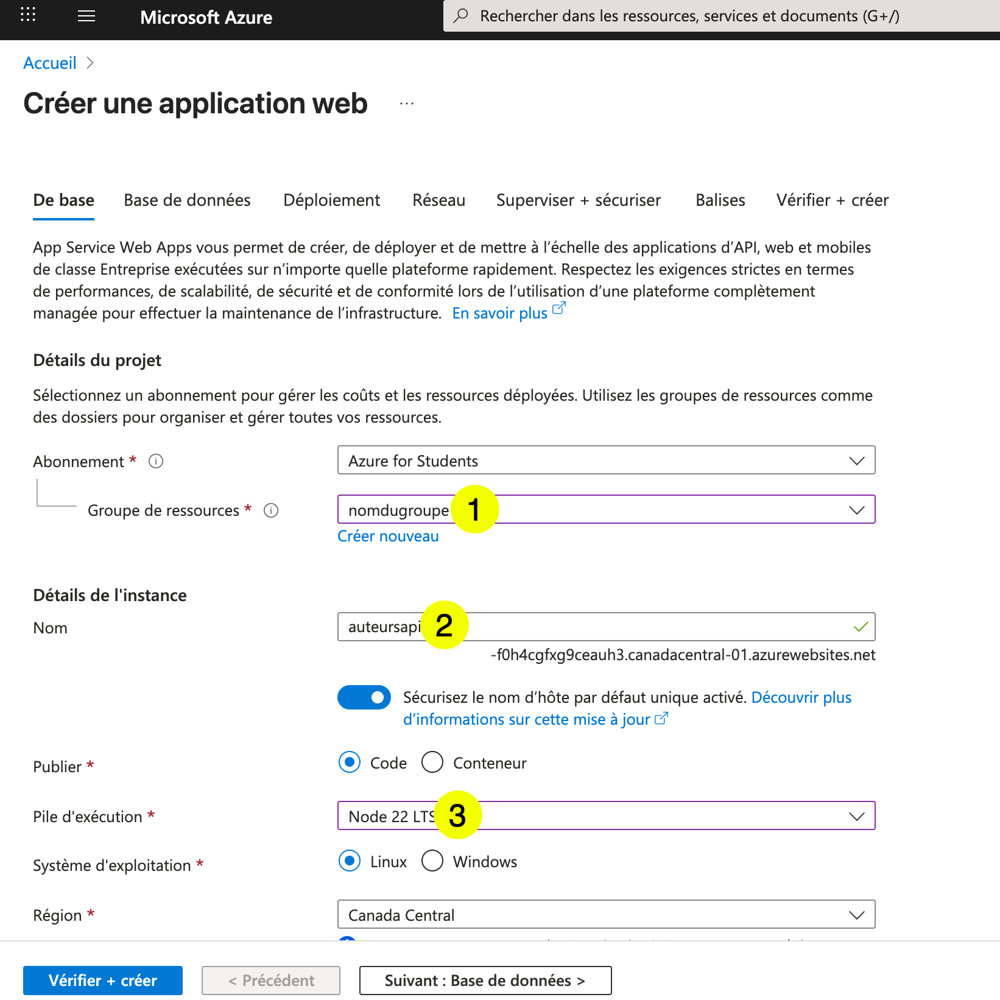
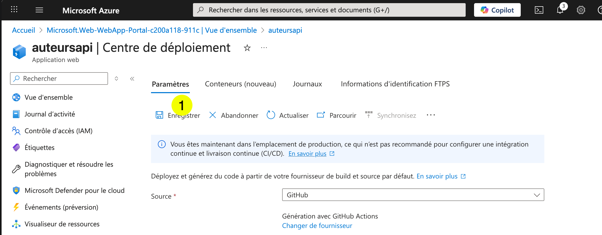
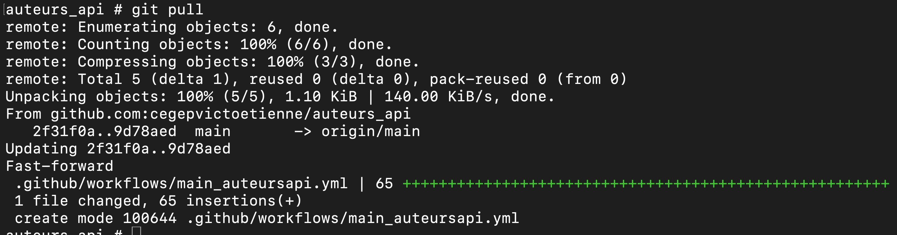
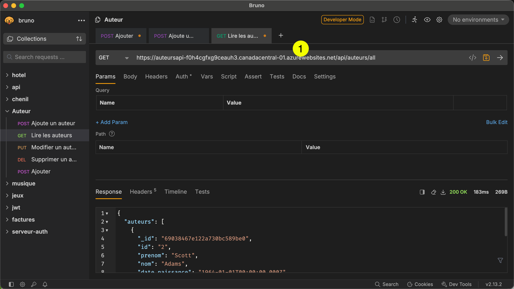
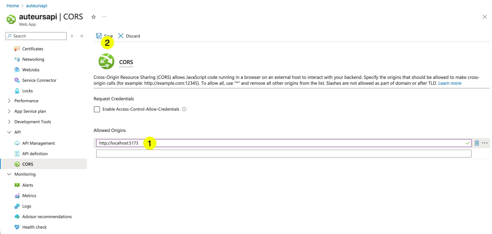

# Déploiement d'une API Express dans Azure

# Préparer le code pour l'exécution dans Azure  


## Fichier config.ts

Mettre en commentaires la section qui traite `dotenv` :  


``` ts title="config.ts"
{!auteur_mongoose/config.ts!}
```

## Fichier vitest.config.ts

``` ts title="vitest.config.ts"
// vitest.config.ts
 
import { defineConfig } from "vitest/config";
import path from "path";
 
 
export default defineConfig({
  test: {
    setupFiles: ["./tests/setup-env.ts"],
    globals: true,
  },
    resolve: {
    alias: {
        "@src": path.resolve(__dirname, "src"),
    },
  },
});
```

``` ts title="/tests/setup-env.ts"   
// tests/setup-env.ts

import { config } from 'dotenv';
import path from 'path';

config({ path: path.resolve(__dirname, '../.env.test') });

``` 


## Fichier build.ts  

Le fichier `build.ts` sert à préparer et compiler l'API Express en production. C'est ce script qui sera exécuté dans Azure.  Il faut s'assurer qu'il s'exécute sans erreur. (Peut varier d'un projet à l'autre...)  

``` ts title="/scripts/build.ts"
{!auteur_mongoose/scripts/build.ts!}
```

Pour le tester, faire la commande suivante :  

``` noderepl 
npm run build  
``` 

## Pousser les modifications sur GitHub  

Assurez-vous que le code est complet et fonctionnel avant de le pousser dans GitHub.  


# Création de la ressource dans Azure  

## Lancer la création dans le portail Azure  

  

  

## Remplir le formulaire  


  

1- Sélectionner le groupe de ressources créé avec MongoDB  
2- Donner un nom au service  
3- Sélectionner `node 22 LTS` 

  

4- Créer un plan de tarification  

  

5- Nommer le plan de tarification
6- Clique sur OK

  

7-  Sélectionner `Gratuit F1` 

  

7-  Cliquer sur `Vérifier et créer` 

## Réviser et créer  

  

1- Vérifier que c'est bien gratuit   
2- Cliquer sur Créer   

## Attendre la fin de la création  

  


## Aller au centre de déploiement (à partir de la page de la ressource)

   

## Configurer la source    

   

1- Cliquer sur source  
2- Sélectionner GitHub  

## Configurer GitHub  


   


1- Se connecter sur son compte GitHub  
2- Sélectionner l'organisation  
3- Sélectionner le dépôt  
4- Séletionner la branche  
5- Ajouter un workflow à votre dépôt  

## Enregistrer la source  

   

# Faire un git pull dans le dossier sur votre machine.  (Pour recevoir le workflow créé par Azure)  


   

## Adapter le workflow  

Ouvrir le workflow dans VSCode et ajuster les paramètres (par exemple, on peut retirer l'exécution des tests lors du déploiement)  


   

Une fois le workflow modifié, le pousser dans GitHub.  


## Configer les variables d'environnement  


   

   

   

1- Entrer le nom de la variable utilisée dans votre API.  
2- Entrer la valeur de la variable.  
3- Cliquer sur appliquer.  


   

  
1- Cliquer sur appliquer.  


# Redémarrer le service  

   


1- Aller à la vue d'ensemble.    
2- Cliquer sur redémarrer.  

# Aller voir les journaux d'exécution de l'API  


   

1- Menu supervision.   
2- Option Flux de journaux.  
3- Vérifier que votre serveur soit bien démarré.  

# Tester votre API  

## Trouver l'URL de votre API  

   

## Tester l'API dans bruno  

   

# Configurer CORS pour votre application React sur localhost  

   

1- Menu API  
2- Option CORS  


   

1- Ajouter `http://localhost:5173`  
2- Cliquer `save`  


