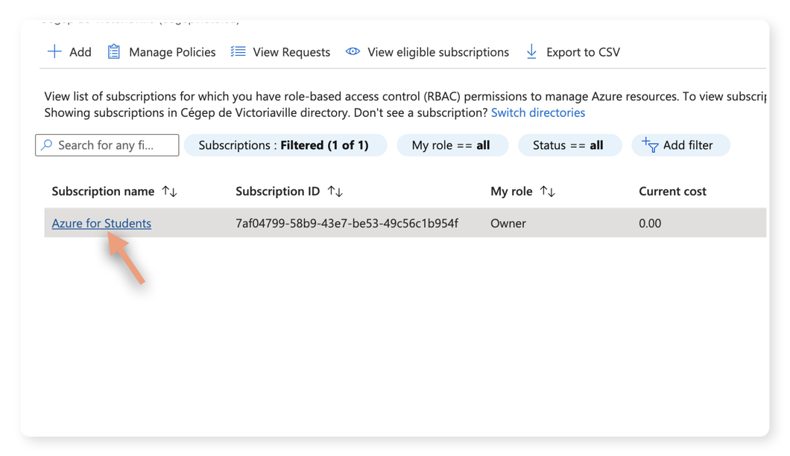
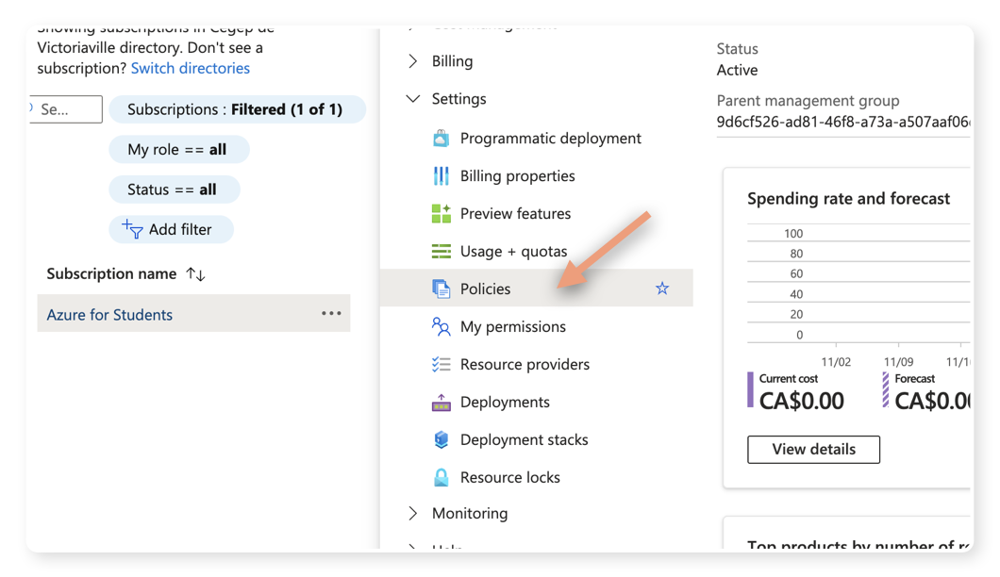

# Tutoriel : Trouver les régions de déploiement disponibles dans Azure

Ce tutoriel vous guidera à travers les étapes pour trouver les régions de déploiement disponibles pour votre abonnement « Azure for Students ».

## 1. Cliquer sur « Subscriptions »
Dans le portail Azure, naviguez vers la section « Subscriptions ».

## 2. Cliquer sur « Azure for Students »
À partir de la liste de vos abonnements, sélectionnez votre abonnement « Azure for Students ».

## 3. Cliquer sur « Policies »
Dans le menu de gauche de votre abonnement, trouvez et cliquez sur « Policies » sous la section des paramètres (« Settings »).

## 4. Cliquer sur « Allowed resource deployment regions »
Dans la liste des stratégies (« policies »), trouvez celle nommée « Allowed resource deployment regions » et cliquez dessus.

## 5. Cliquer sur « View assignment »
Sur la page des détails de la stratégie, cliquez sur « View assignment » pour voir comment cette stratégie est appliquée.

## 6. Dans le paramètre, vous voyez les régions disponibles pour le déploiement
Sous l'onglet des paramètres (« Parameters »), vous trouverez la liste des régions où vous êtes autorisé à déployer des ressources.

