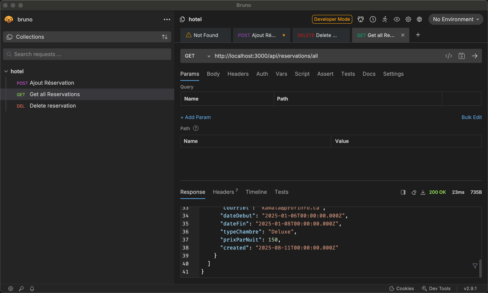

# Bruno - Remplacement __open source__ de Postman  


  


Bruno :  

- est libre de droit  
- utilise des formats standards de données  
- fonctionne 100% hors ligne  
- compatible avec git  


# Installation de Bruno  

Téléchargez Bruno ici :  [Page de téléchargement](https://www.usebruno.com/downloads)  


# Utilisation de Bruno  

1- Créer un dossier `bruno` à la racine de votre projet.  
2- Ajouter tous les appels à votre API dans le dossier `bruno`. (Soit par l'IDE, soit en créant des fichiers `.bru`)  

# Exemple de fichier `.bru` pour un GET  

``` ts title="bruno/hotel/Get All.bru"  
{!hotel25/bruno/hotel/Get All.bru!}

```

# Exemple de fichier `.bru` pour un POST  

``` ts title="bruno/hotel/Ajout Réservation.bru"  
{!hotel25/bruno/hotel/Ajout Réservation.bru!}

```