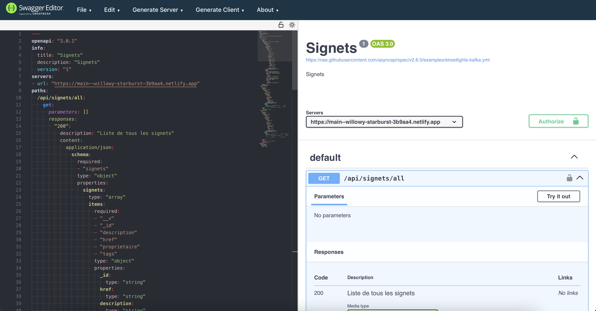
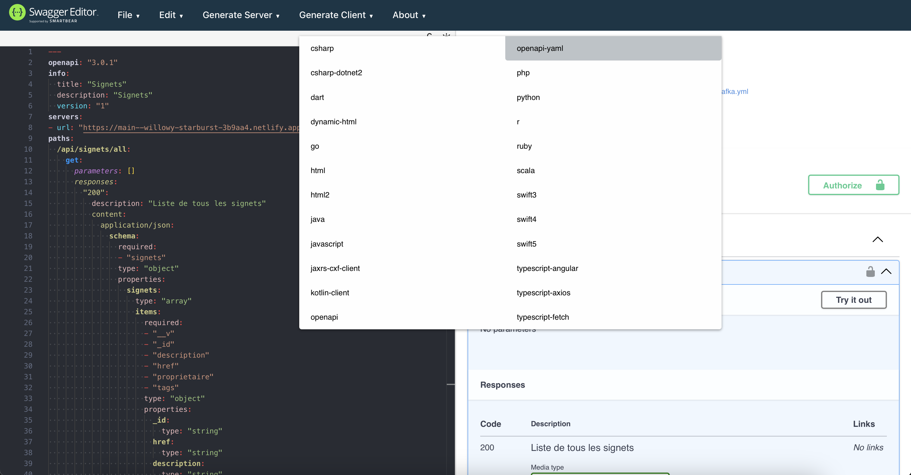

# Rendre disponible la documentation de l'interface logicielle avec express et netlify  

## Documentation de l'interface logicielle

1. Utiliser [SwaggerEditor](https://editor-next.swagger.io) pour créer la documentation de l'interface logicielle.  

    

1. Exporter votre documentation en format yaml.  

    

1. Convertir le fichier yaml en html avec redoc-cli.  

    ``` nodejsrepl title="console"
    npx @redocly/cli build-docs -o index.html api.yaml
    ```

1. Copier le index.html dans le dossier 'src' de votre projet. 

1. Copier également le index.html dans le dossier 'functions' de votre projet, pour le rendre disponible sur le serveur netlify.

1. Ajouter le code suivant dans le fichier 'server.ts' pour rendre disponible la documentation dans la route '/api-docs.  

    ```javascript
    // rend disponible la documentation de l'interface logicielle
    app.get('/api-docs/', async (req, res) => {
        res.set('Content-Security-Policy', 'script-src blob:');
        res.set('Content-Security-Policy', 'worker-src blob:');
        res.sendFile(path.join(__dirname, 'index.html'));
    });

    // redirige vers api-docs
    app.get('/', (req, res) => {
        res.redirect('/api-docs');
    });
    ```

1. Mettre à jour le fichier 'netlify.toml' pour rendre disponible la documentation sur le serveur netlify.  

    ```toml
    [build]
    command = "npm install && npm run build"
    functions = "functions"
    [functions]
    external_node_modules = ["express"]
    # Ajout de la documentation de l'interface logicielle
    included_files=["./functions/index.html"]
    node_bundler = "esbuild"
    [[redirects]]
    force = true
    from = "/*"
    status = 200
    to = "/.netlify/functions/api/:splat"
    ```

1. Pousser les changements dans le dépôt git et vérifier que la documentation est disponible sur le serveur netlify.  

