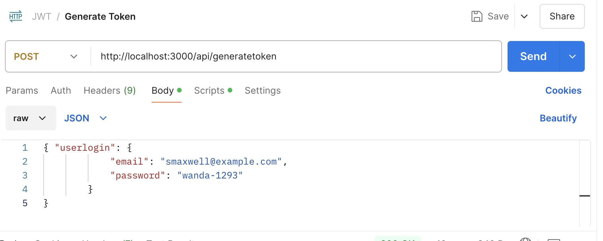
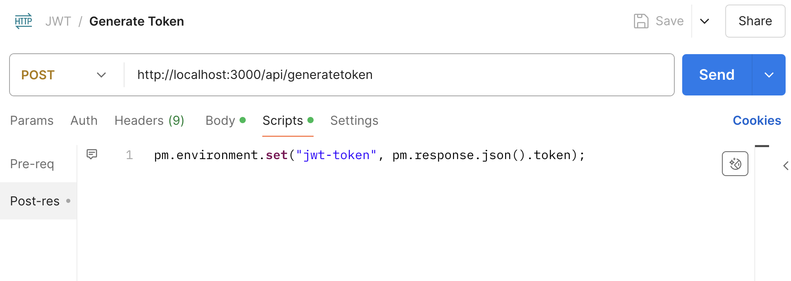
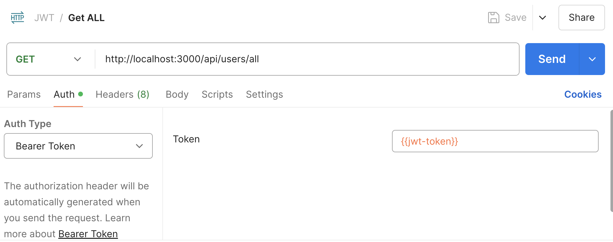

# Express et JWT  

JWT (JSON Web Token) permet d’authentifier un utilisateur lors de chaque appel d'un point d'interface logicielle.  

- Le jeton est généré par le serveur, qui s’assure que l’utilisateur est bien celui qu’il prétend.  
- Le jeton est envoyé au client et ce dernier le conserve dans un témoin pour l’utiliser à chaque appel d'un point d'interface logicielle.  
- Un intergiciel du côté du serveur valide chaque appel d'un point d'interface logicielle en vérifiant le jeton.  
- Si le jeton n’est pas valide, le point d'interface logicielle ne retourne pas de données.  

!!! Manuel  
    [Wikipedia - Article sur JWT](https://en.wikipedia.org/wiki/JSON_Web_Token)  


## Installer le module pour créer et valider les jetons  

``` nodejsrepl title="console"
npm install jsonwebtoken @types/jsonwebtoken
```

## Le service de génération de jetons  

``` ts title="src/services/JetonService.ts"
{!api_avec_jwt/src/services/JetonService.ts!}
```

## Le chemin pour les jetons  

``` ts title="src/common/Paths.ts"
{!api_avec_jwt/src/common/Paths.ts!}
```

## La route  

``` ts title="src/routes/JetonRoutes.ts"
{!api_avec_jwt/src/routes/JetonRoutes.ts!}
```

## Le Router
  
``` ts title="src/routes/index.ts"
{!api_avec_jwt/src/routes/index.ts!}
```

## L'intergiciel pour valider les jetons  

``` ts title="src/util/authenticateToken.ts"
{!api_avec_jwt/src/util/authenticateToken.ts!}
```

## Ajouter l'intergiciel au serveur 

``` ts title="src/server.ts"
{!api_avec_jwt/src/server.ts!}
```

# Configurer Postman pour utiliser les jetons

1. Créer une requête POST pour obtenir un jeton.
  

2. Dans Script, ajouter le code suivant pour conserver le jeton dans une variable d'environnement.
  ``` js
  pm.environment.set("jwt-token", pm.response.json().token);
  ```
  

3. Créer une requête GET pour obtenir les données. Dans la section Auth, sélectionner Bearer Token et ajouter la variable d'environnement `jwt-token`.
  

4. Exécuter la requête de génération avant celle du GET pour obtenir les données.

