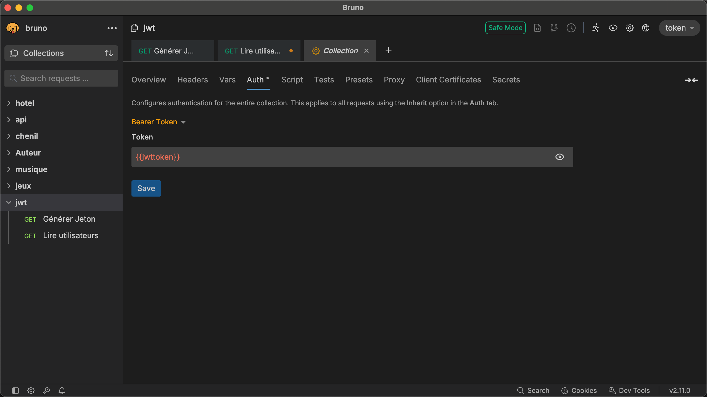

# Express et JWT  

JWT (JSON Web Token) permet d’authentifier un utilisateur lors de chaque appel d'un point d'interface logicielle.  

- Le jeton est généré par le serveur, qui s’assure que l’utilisateur est bien celui qu’il prétend.  
- Le jeton est envoyé au client et ce dernier le conserve dans un témoin pour l’utiliser à chaque appel d'un point d'interface logicielle.  
- Un intergiciel du côté du serveur valide chaque appel d'un point d'interface logicielle en vérifiant le jeton.  
- Si le jeton n’est pas valide, le point d'interface logicielle ne retourne pas de données.  

!!! Manuel  
    [Wikipedia - Article sur JWT](https://en.wikipedia.org/wiki/JSON_Web_Token)  


## Installer le module pour créer et valider les jetons  

``` nodejsrepl title="console"
npm install jsonwebtoken @types/jsonwebtoken
```

## La variable d'environnement dans dev  
``` ts title="config/.env.development"
{!api_avec_jwt_25/config/.env.development!}
```

## Exposer la variable dans ENV
``` ts title="src/common/constants/ENV.ts"
{!api_avec_jwt_25/src/common/constants/ENV.ts!}
```

## Passer à ES2022

``` ts title="src/tsconfig.json"
{!api_avec_jwt_25/tsconfig.json!}
```

## Le modèle User (Ajouter UserLogin) 

``` ts title="src/models/User.ts"
{!api_avec_jwt_25/src/models/User.ts!}
```

## Le service de génération de jetons  

``` ts title="src/services/JetonService.ts"
{!api_avec_jwt_25/src/services/JetonService.ts!}
```

## Le chemin pour les jetons  

``` ts title="src/common/constants/Paths.ts"
{!api_avec_jwt_25/src/common/constants/Paths.ts!}
```

## La route  

``` ts title="src/routes/JetonRoutes.ts"
{!api_avec_jwt_25/src/routes/JetonRoutes.ts!}
```

## Le Router
  
``` ts title="src/routes/index.ts"
{!api_avec_jwt_25/src/routes/index.ts!}
```

## L'intergiciel pour valider les jetons  

``` ts title="src/services/authenticateToken.ts"
{!api_avec_jwt_25/src/services/authenticateToken.ts!}
```

## Ajouter l'intergiciel au serveur 

``` ts title="src/server.ts"
{!api_avec_jwt_25/src/server.ts!}
```

# Configurer Bruno pour utiliser les jetons

1. Créer variable de collection.  
    
  
2. Créer une requête GET pour obtenir un jeton.
  

3. Dans Script, ajouter le code suivant pour conserver le jeton dans une variable d'environnement.
  ``` js
  bru.setEnvVar("jwttoken", res.body.token)
  ```
4. Dans la collection, ajouter la variable dans l'auth Bearer Token  
    

5. Créer une requête GET pour obtenir les données. 
  

6. Exécuter la requête de génération avant celle du GET pour obtenir les données.

