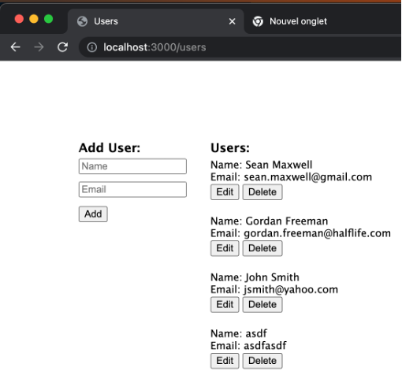

# Générateur de modèle pour Express  

Il y a un Générateur d’applications Express qui permet de générer la structure de base recommandée en Typescript. 

Voici comment générer l’application  
Situez vous dans le dossier où vous désirez créer l’application (le dossier de l’application sera automatiquement créé à la prochaine étape)  

Exécutez la commande de création d’application :  

``` nodejsrepl title="console"
npx express-generator-typescript mapremierappexpress
```

Une fois l’application générée, déplacez-vous dans le dossier créé et installez les modules  

``` nodejsrepl title="console"
cd mapremierappexpress
npm install 
```

Exécutez l’application en utilisant la commande suivante :  

``` nodejsrepl title="console"
npm run dev 
```

<figure markdown>
  { width="600" }
  <figcaption>Exécution du modèle Express</figcaption>
</figure>


Documentation officielle :   

- [Express](https://expressjs.com/fr/starter/installing.html)  
- [Express Generator](https://github.com/seanpmaxwell/express-generator-typescript)  

# Coder un API Express  

L'exemple suivant code une mini API qui gère des réservations dans un hotel.  

## Étape 1 - Créer l’interface model/  

``` ts title="model/Reservation.ts"
// **** Variables **** //

const INVALID_CONSTRUCTOR_PARAM =
  'nameOrObj arg must a string or an ' +
  'object with the appropriate user keys.';

export enum TypeChambre {
  Standard,
  Deluxe,
}

// **** Types **** //

export interface IReservation {
  id: number;
  nomClient: string;
  courrielClient: string;
  dateDebut: string;
  dateFin: string;
  typeChambre: TypeChambre;
  prixParNuit: number;
}

// **** Functions **** //

/**
 * Créer une réservation.
 */
function new_(
  nomClient?: string,
  courrielClient?: string,
  dateDebut?: string,
  dateFin?: string,
  typeChambre?: TypeChambre,
  prixParNuit?: number,
  id?: number // id last cause usually set by db
): IReservation {
  return {
    id: id ?? -1,
    nomClient: nomClient ?? '',
    courrielClient: courrielClient ?? '',
    dateDebut: dateDebut ?? '',
    dateFin: dateFin ?? '',
    typeChambre: typeChambre ?? TypeChambre.Standard,
    prixParNuit: prixParNuit ?? 0,
  };
}

/**
 * Extraire une réservation d'un objet.
 */
function from(param: object): IReservation {
  // Check is réservation
  if (!isReservation(param)) {
    throw new Error(INVALID_CONSTRUCTOR_PARAM);
  }
  // Get user instance
  const p = param as IReservation;
  return new_(
    p.nomClient,
    p.courrielClient,
    p.dateDebut,
    p.dateFin,
    p.typeChambre,
    p.prixParNuit,
    p.id
  );
}

/**
 * See if the param meets criteria to be a réservation.
 */
function isReservation(arg: unknown): boolean {
  return (
    !!arg &&
    typeof arg === 'object' &&
    'id' in arg &&
    'nomClient' in arg &&
    'courrielClient' in arg &&
    'dateDebut' in arg &&
    'dateFin' in arg &&
    'typeChambre' in arg &&
    'prixParNuit' in arg
  );
}

// **** Export default **** //

export default {
  new: new_,
  from,
  isReservation,
} as const;

```

## Étape 2 - Ajouter le modèle à la base de données bidon 

``` ts title="repos/MockOrm.ts"
import jsonfile from 'jsonfile';

import { IReservation } from '@src/models/Reservation';

// **** Variables **** //

const DB_FILE_NAME = 'database.json';

// **** Types **** //

interface IDb {
  reservations: IReservation[];
}

// **** Functions **** //

/**
 * Fetch the json from the file.
 */
function openDb(): Promise<IDb> {
  return jsonfile.readFile(__dirname + '/' + DB_FILE_NAME) as Promise<IDb>;
}

/**
 * Update the file.
 */
function saveDb(db: IDb): Promise<void> {
  return jsonfile.writeFile(__dirname + '/' + DB_FILE_NAME, db);
}

// **** Export default **** //

export default {
  openDb,
  saveDb,
} as const;

```

## Étape 3 - Mettre à jour la base de données  

``` json title="repos/database.json" 
{
  "reservations": [
    {
      "id": 1,
      "nomClient": "Justin Trudeau",
      "courrielClient": "justin@kerzo.ca",
      "dateDebut": "2023-09-01",
      "dateFin": "2023-09-03",
      "typeChambre": "Deluxe",
      "prixParNuit": 150
    }
  ]
}
```  

## Étape 4 - Créer le repo  

``` ts title="repos/ReservationRepo.ts"
import { IReservation } from '@src/models/Reservation';
import { getRandomInt } from '@src/util/misc';
import orm from './MockOrm';

// **** Functions **** //

/**
 * Extraire une réservation.
 */
async function getOne(courrielClient: string): Promise<IReservation | null> {
  const db = await orm.openDb();
  for (const reservation of db.reservations) {
    if (reservation.courrielClient === courrielClient) {
      return reservation;
    }
  }
  return null;
}

/**
 * Vérifier si une réservation avec l'ID existe
 */
async function persists(id: number): Promise<boolean> {
  const db = await orm.openDb();
  for (const reservation of db.reservations) {
    if (reservation.id === id) {
      return true;
    }
  }
  return false;
}

/**
 * Extraire toutes les réservations.
 */
async function getAll(): Promise<IReservation[]> {
  const db = await orm.openDb();
  return db.reservations;
}

/**
 * Ajouter une réservation.
 */
async function add(reservation: IReservation): Promise<void> {
  const db = await orm.openDb();
  reservation.id = getRandomInt();
  db.reservations.push(reservation);
  return orm.saveDb(db);
}

/**
 * Mettre à jour une réservation
 */
async function update(reservation: IReservation): Promise<void> {
  const db = await orm.openDb();
  for (let i = 0; i < db.reservations.length; i++) {
    if (db.reservations[i].id === reservation.id) {
      db.reservations[i] = reservation;
      return orm.saveDb(db);
    }
  }
}

/**
 * Supprimer une réservation.
 */
async function delete_(id: number): Promise<void> {
  const db = await orm.openDb();
  for (let i = 0; i < db.reservations.length; i++) {
    if (db.reservations[i].id === id) {
      db.reservations.splice(i, 1);
      return orm.saveDb(db);
    }
  }
}

// **** Export default **** //

export default {
  getOne,
  persists,
  getAll,
  add,
  update,
  delete: delete_,
} as const;

```

## Étape 5 - Créer le service  

``` ts title="services/ReservationService.ts"
import ReservationRepo from '@src/repos/ReservationRepo';
import { IReservation } from '@src/models/Reservation';
import { RouteError } from '@src/other/classes';
import HttpStatusCodes from '@src/constants/HttpStatusCodes';

// **** Variables **** //

export const RESERVATION_NOT_FOUND_ERR = 'Réservation non trouvée';

// **** Functions **** //

/**
 * Extraire toutes les réservations.
 */
function getAll(): Promise<IReservation[]> {
  return ReservationRepo.getAll();
}

/**
 * Ajouter une réservation.
 */
function addOne(reservation: IReservation): Promise<void> {
  return ReservationRepo.add(reservation);
}

/**
 * Mettre à jour une réservation.
 */
async function updateOne(reservation: IReservation): Promise<void> {
  const persists = await ReservationRepo.persists(reservation.id);
  if (!persists) {
    throw new RouteError(HttpStatusCodes.NOT_FOUND, RESERVATION_NOT_FOUND_ERR);
  }
  // Retourner la réservation
  return ReservationRepo.update(reservation);
}

/**
 * Efface une réservation par son ID
 */
async function _delete(id: number): Promise<void> {
  const persists = await ReservationRepo.persists(id);
  if (!persists) {
    throw new RouteError(HttpStatusCodes.NOT_FOUND, RESERVATION_NOT_FOUND_ERR);
  }
  // Efface la réservation
  return ReservationRepo.delete(id);
}

// **** Export default **** //

export default {
  getAll,
  addOne,
  updateOne,
  delete: _delete,
} as const;

```

## Étape 6 - Créer les routes  

``` ts title="routers/ReservationRoute.ts"
import HttpStatusCodes from '@src/constants/HttpStatusCodes';

import ReservationService from '@src/services/ReservationService';
import { IReservation } from '@src/models/Reservation';
import { IReq, IRes } from './types/express/misc';

// **** Functions **** //

/**
 * Extraire toutes les réservations.
 */
async function getAll(_: IReq, res: IRes) {
  const reservations = await ReservationService.getAll();
  return res.status(HttpStatusCodes.OK).json({ reservations });
}

/**
 * Ajouter une réservation.
 */
async function add(req: IReq<{ reservation: IReservation }>, res: IRes) {
  const { reservation } = req.body;
  await ReservationService.addOne(reservation);
  return res.status(HttpStatusCodes.CREATED).end();
}

/**
 * Mettre à jour une réservation.
 */
async function update(req: IReq<{ reservation: IReservation }>, res: IRes) {
  const { reservation } = req.body;
  await ReservationService.updateOne(reservation);
  return res.status(HttpStatusCodes.OK).end();
}

/**
 * Supprimer une réservation.
 */
async function delete_(req: IReq, res: IRes) {
  const id = +req.params.id;
  await ReservationService.delete(id);
  return res.status(HttpStatusCodes.OK).end();
}

// **** Export default **** //

export default {
  getAll,
  add,
  update,
  delete: delete_,
} as const;

```

## Étape 7 - Ajouter les chemins de l’API dans les constantes  

``` ts title="routes/constants/Paths.ts"
/**
 * Express router paths go here.
 */

import { Immutable } from '@src/other/types';

const Paths = {
  Base: '/api',
  Reservations: {
    Base: '/reservations',
    Get: '/',
    Add: '/',
    Update: '/',
    Delete: '/delete/:id',
  },
};

// **** Export **** //

export type TPaths = Immutable<typeof Paths>;
export default Paths as TPaths;

```

## Étape 8 - Ajouter les chemins de l’API dans api.ts  

``` ts title="routes/api.ts"
import { Router } from 'express';
import jetValidator from 'jet-validator';

import Paths from './constants/Paths';
import Reservation from '@src/models/Reservation';
import ReservationRoute from './ReservationRoute';

// **** Variables **** //

const apiRouter = Router(),
  validate = jetValidator();

// ** Add UserRouter ** //

const reservationRouter = Router();

// Extraire toutes les réservations
reservationRouter.get(Paths.Reservations.Get, ReservationRoute.getAll);

// Ajouter une réservation
reservationRouter.post(
  Paths.Reservations.Add,
  validate(['reservation', Reservation.isReservation]),
  ReservationRoute.add
);

// Mise à jour d'une réservation
reservationRouter.put(
  Paths.Reservations.Update,
  validate(['reservation', Reservation.isReservation]),
  ReservationRoute.update
);

// Supprimer une réservation
reservationRouter.delete(
  Paths.Reservations.Delete,
  validate(['id', 'number', 'params']),
  ReservationRoute.delete
);

// Ajouter le router à l'API
apiRouter.use(Paths.Reservations.Base, reservationRouter);

// **** Export default **** //

export default apiRouter;

```