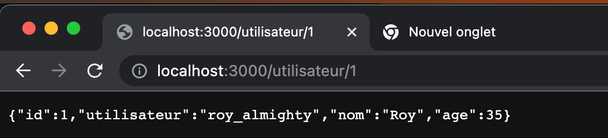
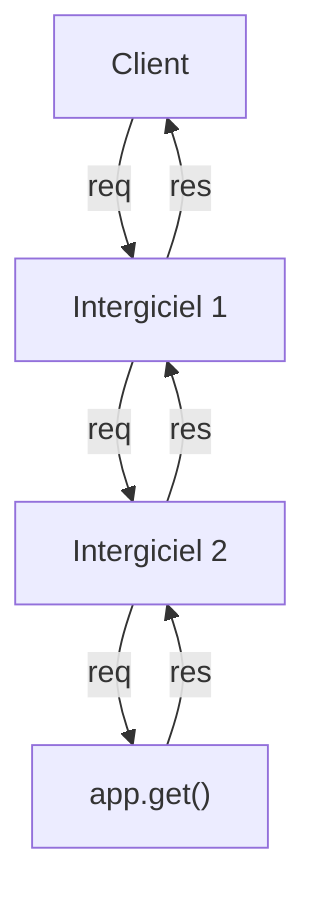

# Express  

__Express.js__ est un framework pour construire des applications web en Node.js. C'est de fait le framework standard pour le développement de serveur en Node.js.  

Documentation officielle: 

!!! manuel 
    [Express JS](https://expressjs.com/fr/)  


Sources :  

- [Wikipedia](https://fr.wikipedia.org/wiki/Express.js)  
- [JetBrains](https://www.jetbrains.com/help/phpstorm/2016.3/running-and-debugging-node-js.html)  

Pour installer Express :

``` nodejsrepl title="console"
npm install express @types/express
```

# Premier serveur Express  

``` ts title="serveur.ts"
import express from 'express';

const app = express();
const PORT = 3000;

app.get('/', (req: express.Request, res: express.Response) => {
    res.send({
        id: 1,
        utilisateur: 'roy_almighty',
        nom: 'Roy',
        age: 35,
    });
});

app.listen(PORT, () => {
    console.log(`Serveur démarré sur le port ${PORT}`);
});

```

# Express – Requêtes HTTP  

- L’objet __req__ représente la requête HTTP transmise au serveur.     
- Cet objet permet, entre autres :   
    - D’accéder aux paramètres transmis dans l’URL  
    - D’accéder aux données transmise dans le corps de la requête (body)  
    - De manipuler les cookies  
    - Etc.  
- Les prochaines diapositives vous montrerons comment :  
- Obtenir les paramètres dans une méthode {==GET==}  
- Obtenir les informations du body dans une méthode {==POST==}  

!!! manuel 
    [Express API](https://expressjs.com/en/4x/api.html#req)

# Express – Les routes dynamiques  


!!! note

    :id  

    Le : informe que cette valeur est variable

    id= req.params.id

    Récupère la valeur du paramètre dans une variable nommée id.

``` ts title="serveur.ts"  
app.get('/utilisateur/:id', (req: express.Request, res: express.Response) => {
    if (!_.isNaN(+req.params.id)) {
        const id = +req.params.id;
        const utilisateur = _.find(listeUtilisateurs, { id: id });
        if (utilisateur) {
            res.send(utilisateur);
        } else {
            res.status(404).send(`Utilisateur avec id ${id} n'existe pas.`);
        }
    } else {
        res.send({
            erreur: `"${req.params.id}" est invalide.`,
        });
    }
});
```

<figure markdown>
  { width="600" }
  <figcaption>Route dynamique</figcaption>
</figure>

# Middleware (Intergiciel)  

Lorsque la requête arrive, elle passe à travers chaque intergiciel.  
L’intergiciel appelle le prochain avec next()  




``` ts title="intergiciel.ts"  
function historique(
    req: express.Request,
    res: express.Response,
    next: express.NextFunction
) {
    console.log(`${req.method} ${req.url}`);
    next();
}

app.use(historique);

```

# Intergiciel - morgan  

Morgan est un intergiciel pour garder l’historique des requêtes traitées par votre serveur Express.

Pour l’installation :
``` nodejsrepl title="console"
npm install morgan @types/morgan
```

Pour l’utilisation :  

``` ts title="utilisation_morgan.ts"
import morgan from 'morgan’;

app.use(morgan('dev'));

```

!!! manuel  
    [Morgan - ExpressJS](https://expressjs.com/en/resources/middleware/morgan.html)  


# Intergiciel – express.json()  

Intergiciel pour transformer le json reçu du client en objet, remplace req.body.  

Utilisation :  

``` ts title="tableau_de_fruits.ts"
app.use(express.json());

app.post('/', (req: express.Request<Utilisateur>, res: express.Response) => {
    const nouvelUtilisateur: Utilisateur = {
        id: req.body.id,
        utilisateur: req.body.utilisateur,
        nom: req.body.nom,
        age: req.body.age,
    };
    listeUtilisateurs.push(nouvelUtilisateur);
    res.send(nouvelUtilisateur);
    console.log(nouvelUtilisateur);
});

```

!!! manuel  
    [express.json - ExpressJS](https://expressjs.com/en/api.html#express.json)  


# Routes  

Les routes permettent de regrouper les URL d’un API.  

Par exemple :  

``` ts title="tableau_de_fruits.ts"
const routeur = Router();

routeur.get('/', (req: express.Request, res: express.Response) => {
    res.send(listeUtilisateurs);
});

app.use('/utilisateur', routeur);

```
!!! manuel  
    [Router - ExpressJS](https://expressjs.com/en/5x/api.html#router)  


# Routes et méthodes HTTP  

Dans l’exemple précédent, la requête utilise la méthode GET, qui récupèrent les informations directement dans l’URL. 

Comme vous l’avez appris dans vos cours précédents, d’autres méthodes sont aussi définies dans le protocole HTTP. Les plus communes sont : GET, POST, PUT, DELETE.   

Avec Node.js, il est possible d’utiliser la même URL avec différentes méthodes. Cela se fait en modifiant la méthode auprès de la route :  
Méthode GET: 	router.get(path, function(req, res, next) { … })  
Méthode POST:	router.post(path, function(req, res, next) { … })  
Méthode PUT: 	router.put(path, function(req, res, next) { … })  
Méthode DELETE:	router.delete(path, function(req, res, next) { … })  

!!! manuel  
    [MDN HTTP Methods](https://developer.mozilla.org/fr/docs/Web/HTTP/Methods)  

