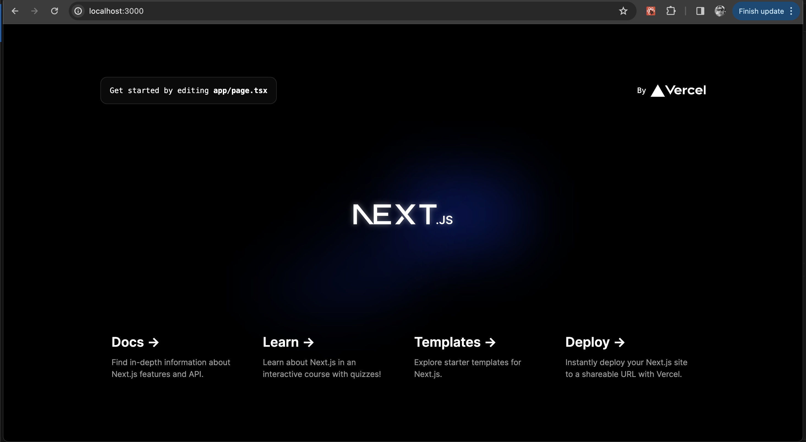
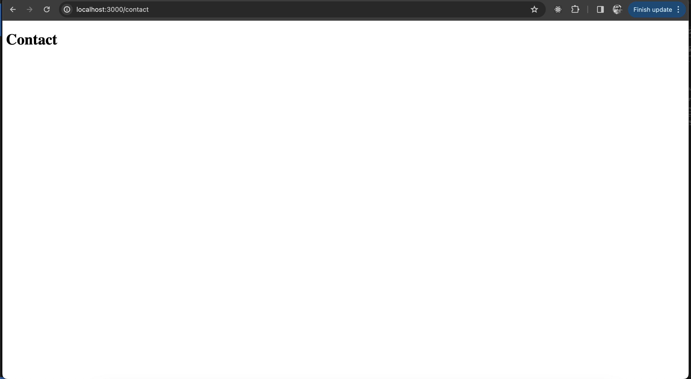

## Next JS

Next.js est un cadriciel de développement web full-stack qui permet de créer des applications Web avec React. 

Avec Next.js, les pages sont générées du côté serveur au lieu du côté client. Cela permet d'améliorer la performance et le référencement des applications Web.

!!! manuel  
    [Documentation officielle Next.js](https://nextjs.org/docs) 

# Générer un projet en Next.js

``` nodejsrepl title="console"

npx create-next-app@latest


✔ What is your project named? … firstapp
✔ Would you like to use TypeScript? … No / **Yes**
✔ Would you like to use ESLint? … No / **Yes**
✔ Would you like to use Tailwind CSS? … **No** / Yes
✔ Would you like to use `src/` directory? … **No** / Yes
✔ Would you like to use App Router? (recommended) … No / **Yes**
✔ Would you like to customize the default import alias (@/*)? … **No** / Yes  
```

!!! manuel  
    [Installation Next.js](https://nextjs.org/docs/getting-started/installation) 


# Structure d'un projet Next.js

``` text title="Structure d'un projet Next.js"
    firstapp
    ├── app
    │   ├── global.css
    │   ├── layout.tsx
    │   ├── page.module.css
    │   ├── page.tsx
    ├── public
    │   ├── next.svg
    │   └── vercel.svg
    ├── next-env.d.ts
    ├── node_modules
    ├── package-lock.json
    ├── package.json
    ├── README.md
    └── tsconfig.json
```

# Démarrer le projet

``` nodejsrepl title="console"
    npm run dev
```



## Page principale du projet app/page.tsx

Une page Next.js est un composant React exporté à partir d'un fichier dans le dossier `pages`. Chaque fichier dans le dossier `pages` est traité comme une route différente par le routeur Next.js.
    
``` ts title="app/page.tsx"
{!premier_site_nextjs/app/page.tsx!}
```

## Disposition du site app/layout.tsx

La disposition est un composant React qui enveloppe les pages Next.js et fournit un moyen pour vous d'ajouter du code qui sera commun à toutes les pages de votre application.

``` ts title="app/layout.tsx"
{!premier_site_nextjs/app/layout.tsx!}
```

### Détails de la disposition

- Pas de balise `<head>` : Next.js gère automatiquement l'importation de `<head>` pour vous. Pour les métadonnées, utilisez la variable `metadata`.  

- C'est ici que se crée la balise `<html>` et la balise `<body>`.  

- Le contenu des pages est inséré via la variable `children`.  

- Le fichier css global est importé ici et donc disponible pour toutes les pages.  

# Créer une page  

Next.js base le routage sur le système de fichiers. Ajoutez un dossier dans le dossier `app`, ajouter un fichier `page.tsx` à ce dossier et il devient une route accessible à l'URL correspondante.

``` text title="ajout d'une page contact dans Next.js"
    firstapp
    ├── app
    |   ├── contact
    │   │   └── page.tsx
    │   ├── next.svg
    │   ├── global.css
    │   ├── layout.tsx
    │   ├── page.module.css
    │   ├── page.tsx
    ├── public
    │   ├── next.svg
    │   └── vercel.svg
    ├── next-env.d.ts
    ├── node_modules
    ├── package-lock.json
    ├── package.json
    ├── README.md
    └── tsconfig.json
```

``` ts title="app/contact/page.tsx"
{!premier_site_nextjs/app/contact/page.tsx!}
```  

  


# Créer un lien entre les pages

Pour créer un lien entre les pages, utilisez le composant `Link` de Next.js. Il fonctionne de la même manière que le composant `Link` de React Router.  

``` ts title="app/page.tsx"
import Link from 'next/link';

<Link href="/contact">Contact</Link>
```

# Noms de fichiers réservés sous `app`  

- `page.tsx`: Crée une nouvelle page.  
- `layout.tsx`: Crée une disposition, pour la page courante et ses enfants.  
- `not-found.tsx`: Crée une page 404.  
- `error.tsx`: Crée une page d'erreur personnalisée, autre que 404.  
- `loading.tsx` : Crée une page de chargement personnalisée.  
- `route.tsx` : Permet de créer des routes pour un API (renvoie du json au lieu d'une page html).  

!!! manuel  
    [Nomenclature des fichiers Next.js]( https://nextjs.org/docs/app/api-reference/file-conventions)  

# Pages dynamiques  

## Nomenclature des fichiers  

``` text title="ajout d'une page contact dans Next.js"
    firstapp
    ├── app
    |   ├── blog
    │   │   ├── [slug]
    │   │   │   └── page.tsx
    │   │   └── page.tsx
```

Le nom du dossier `[slug]` est entre crochets. Cela signifie que c'est un chemin dynamique. Ça alimente la variable `slug` de `params` dans le composant `page.tsx`.  

## Créer une page dynamique  

``` ts title="app/blog/[slug]/page.tsx"
{!premier_site_nextjs/app/blog/[slug]/page.tsx!}
```  

# Ajouter une composante à la disposition  

Prenons par exemple un menu pour le site au complet, que nous nommerons `MainHeader`.  

``` ts title="app/components/main-header.tsx"
{!premier_site_nextjs_avec_menu/components/main-header.tsx!}
```

Pour formatter le menu avec du css, utilisons la méthode du module css de next.js. L'approche est de nommer le fichier css avec le nom du fichier tsx et d'ajouter le mot `module` au nom du fichier. Par exemple, le fichier `main-header.tsx` aura un fichier css nommé `main-header.module.css`.

``` ts title="app/components/main-header.module.css"
{!premier_site_nextjs_avec_menu/components/main-header.module.css!}
```

Pour utiliser le fichier css, il faut importer le module css dans le fichier tsx et utiliser la variable `classes` pour accéder aux classes css.

``` ts title="app/components/main-header.tsx"
import classes from './main-header.module.css';

<header className={classes.header}>
```

# Ajouter une image

Pour ajouter une image dans next.js, il suffit de faire l'importation dans le fichier tsx et d'utiliser la balise `<Image>` fourni avec Next.js avec comme source `image`.

``` ts title="app/components/main-header.tsx"  
import LogoImg from '@/assets/logo.png';
import Image from 'next/image';

<Image src={LogoImg} alt="Raoul la giraffe" />
```

