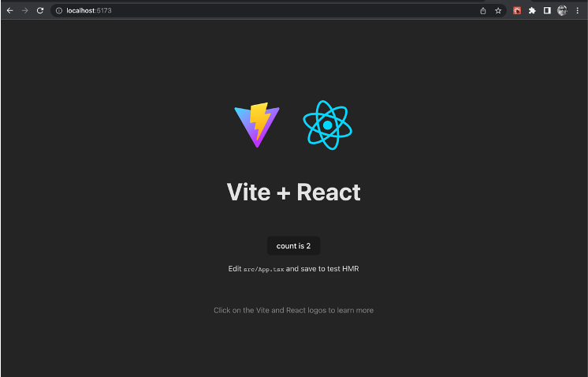
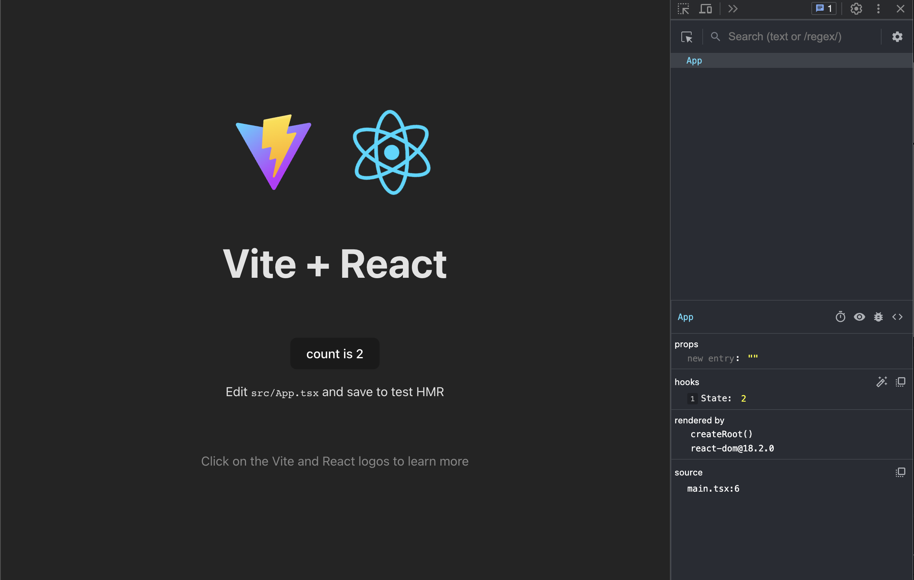

# React  

## Générer un projet en React  

Il y a plusieurs Générateur d’applications React qui permettent de générer la structure de base recommandée en JavaScript ou TypeScript. 

Voici comment générer l’application :  

1. Situez vous dans le dossier où vous désirez créer l’application (le dossier de l’application sera automatiquement créé à la prochaine étape)  
1. Exécutez la commande de création d’application :  
    ``` nodejsrepl title="console"
    npm create vite@latest my_app
    ```
1. Suivez les instructions et choisir __React__ et __TypeScript__  
1. Une fois l’application générée, déplacez-vous dans le dossier créé :  
    ``` nodejsrepl title="console"
    cd my_app
    ```
1. Exécutez l’application en utilisant les commandes suivantes :  
    ``` nodejsrepl title="console"
    npm install
    npm run dev
    ```

<figure markdown>
  { width="600" }
  <figcaption>Page par défaut d'une application Vite en React</figcaption>
</figure>

Pour plus d'information :  

- [Documentation officielle Vite](https://vitejs.dev/guide/)  


# React Developer Tools  

React Developer Tools est un plugin dans Chrome pour aider au débogage de vos applications React.  

Pour l'installer :  [React Developer Tools pour Chrome](https://chrome.google.com/webstore/detail/react-developer-tools/fmkadmapgofadopljbjfkapdkoienihi)  

<figure markdown>
  { width="600" }
  <figcaption>React Development Tools s'installe dans les outils de développement de Chrome</figcaption>
</figure>


# Programmer React avec des fonctions  

Utiliser des fonctions au lieu des classes en React est la manière officielle de programmer dans cet environnement.  

``` ts title="personnage.component.tsx"
import './personnage.styles.css';

const Personnage = () => {
  const nomDuPersonnage = 'Fluffy McChat';
  const photoDuPersonnage = 'https://placekitten.com/300/300';
  const adresseDuPersonnage = '123 Ave Des Félins';

  return (
    <div className="container">
      <div className="photo">
        
      </div>
      <div className="info">
        <p>{nomDuPersonnage}</p>
        <p className="address">{adresseDuPersonnage}</p>
      </div>
    </div>
  );
};

export default Personnage;
```

``` ts title="app.tsx"
import Personnage from './components/personnage.component';
import './App.css';

function App() {
  return <Personnage />;
}

export default App;
```

<figure markdown>
  { width="600" }
  <figcaption>Affichage du projet personnage - base</figcaption>
</figure>

[CodeSandbox - Personnage - Base](https://codesandbox.io/p/sandbox/personnage-base-j9xc7h)  

# Passage de paramètres avec les props  

1. Définir la liste des paramètres dans une interface  
2. L’ajouter comme props à la fonction de la composante  
3. Utiliser les paramètres lors de l’instanciation de la composante  


``` ts title="personnage.component.tsx"
import './personnage.styles.css';

interface IPersonnageProps {
  nom: string;
  photo: string;
  adresse: string;
}

const Personnage = (props: IPersonnageProps) => {
  return (
    <div className="container">
      <div className="photo">
        
      </div>
      <div className="info">
        <p>{props.nom}</p>
        <p className="address">{props.adresse}</p>
      </div>
    </div>
  );
};

export default Personnage;

```

``` ts title="app.tsx"
import Personnage from './components/personnage.component';
import './App.css';

function App() {
  const nomDuPersonnage = 'Fluffy McChat';
  const photoDuPersonnage = 'https://placekitten.com/300/300';
  const adresseDuPersonnage = '123 Ave Des Félins';

  return (
    <>
      <Personnage
        nom={nomDuPersonnage}
        photo={photoDuPersonnage}
        adresse={adresseDuPersonnage}
      />
      <Personnage
        nom="Charmin Ledoux"
        photo="https://placekitten.com/300/300"
        adresse="444 de le Bête"
      />
    </>
  );
}

export default App;

```

<figure markdown>
  { width="600" }
  <figcaption>Affichage du projet personnage - base avec props</figcaption>
</figure>

[CodeSandbox - Personnage - Props](https://codesandbox.io/p/sandbox/personnage-base-8z5j5g)  

# Les hooks - useState  

- Conserve l’état d’une variable  
- Réagit lorsque la valeur change  

``` ts title="app.tsx"
import Personnage from './components/personnage.component';
import { useState } from 'react';
import './App.css';

function App() {
  const [nom, setNom] = useState('');

  const nomDuPersonnage = 'Fluffy McChat';
  const photoDuPersonnage = 'https://placekitten.com/300/300';
  const adresseDuPersonnage = '123 Ave Des Félins';

  return (
    <>
      <input value={nom} onChange={(e) => setNom(e.target.value)} />
      <Personnage
        nom={nomDuPersonnage}
        photo={photoDuPersonnage}
        adresse={adresseDuPersonnage}
      />
      <Personnage
        nom={nom}
        photo="https://placekitten.com/300/300"
        adresse="444 de le Bête"
      />
    </>
  );
}

export default App;
```

<figure markdown>
  { width="600" }
  <figcaption>Affichage du projet personnage - base avec useState</figcaption>
</figure>

[CodeSandbox - Personnage - useState](https://codesandbox.io/p/sandbox/personnage-base-6kdzhk)  


# Hooks : useEffect  

Faire des traitements de données seulement lors d’événements précis, comme le premier render ou lors de changement d’une autre variable.  


``` ts title="app.tsx"
import Personnage from './components/personnage.component';
import { useState, useEffect } from 'react';
import './App.css';

function App() {
  const [nom, setNom] = useState('');
  const [longueurNom, setLongueurNom] = useState(0);

  useEffect(() => {
    setLongueurNom(nom.length);
  }, [nom]);

  const nomDuPersonnage = 'Fluffy McChat';
  const photoDuPersonnage = 'https://placekitten.com/300/300';
  const adresseDuPersonnage = '123 Ave Des Félins';

  return (
    <>
      <input value={nom} onChange={(e) => setNom(e.target.value)} />
      <span>Le nom a {longueurNom} caractères</span>
      <Personnage
        nom={nomDuPersonnage}
        photo={photoDuPersonnage}
        adresse={adresseDuPersonnage}
      />
      <Personnage
        nom={nom}
        photo="https://placekitten.com/300/300"
        adresse="444 de le Bête"
      />
    </>
  );
}

export default App;

```

<figure markdown>
  { width="600" }
  <figcaption>Affichage du projet personnage - base avec useEffect</figcaption>
</figure>

[CodeSandbox - Personnage - useEffect](https://codesandbox.io/p/sandbox/personnage-base-6kdzhk)  


