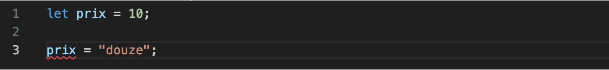
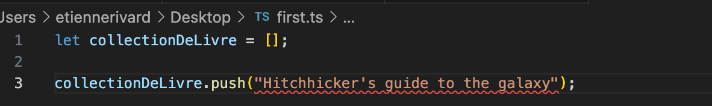

# Introduction à TypeScript

TypeScript c’est du JavaScript avec des types!

Pourquoi des types?

Aide à trouver les erreurs dans notre code.

# Installation de TypeScript  

Pour installer TypeScript, utiliser la commande suivante :

``` nodejsrepl title="console"
npm install –g tsc
```

!!! note

    Ça installe sur votre poste le compilateur TypeScript qui transforme le code en JavaScript. Nous allons voir npm plus en détail au prochain cours

# Indiquer les types aux variables  

<figure markdown>
  { width="600" }
  <figcaption>TypeScript indique que la variable est mal utilisée</figcaption>
</figure>


Dans votre éditeur de code, TypeScript dit que la variable prénom est un string et vous informe que vous l’utilisez avec un autre type. C’est la base de TypeScript, vous éviter des erreurs de la sorte.


<figure markdown>
  { width="600" }
  <figcaption>Erreur dans VSCode venant de TypeScript</figcaption>
</figure>

# Types primitifs  

TypeScript a les types primitifs suivants :  

- string  
- number  
- boolean  
- null  
- void  
- any  
- never  
- unknown  

## Inférence  

TypeScript peut deviner le type selon le contexte :  

<figure markdown>
  { width="600" }
  <figcaption>TypeScript devine le type par le contexte d'utilisation</figcaption>
</figure>

## L'inférence ne marche pas toujours  

Des fois, l’inférence ne fonctionne pas :  

<figure markdown>
  { width="600" }
  <figcaption>Inférence pas toujours parfait</figcaption>
</figure>

Dans ce cas, il faut être explicite :  

<figure markdown>
  { width="600" }
  <figcaption>Aider l'inférence</figcaption>
</figure>

## Any  

Le type Any est pour indiquer que vous prévoyez mettre plus d’un type dans la même variable.  

{==C’est à proscrire==}  

``` ts title="any.ts"
let quelqueChose : any = 'Une patate';

quelqueChose = 12;

quelqueChose = true;

quelqueChose = { nom: 'Taleb', prenom: 'Frédérick' };
```

Ça empêche TypeScript de vous aider!  


## Never  

Utilisé comme paramètre de retour d’une fonction qui ne se terminera jamais.  

``` ts title="boucle_sans_fin.ts"
function bloucleSansFin(): never {
  while (true) {
    console.log("À l'aide, je suis pris ici!");
  }
}
```


## Void  

Utiliser void lorsque votre fonction ne retourne pas de valeur :

``` ts title="bonjour.ts"
function direBonjour(): void {
  console.log("Bonjour!");
}
```

## Unknown  

Unknown est comme Any, dans le sens qu’il peut recevoir n’importe quel type.

``` ts title="unknown.ts"
let quosseCa: unknown;

quosseCa = 1;

quosseCa = "Deux";

quosseCa = false;
```

Mais unknown ne peut etre assigné à aucun autre type de variable que unknown et any:  

<figure markdown>
  { width="600" }
  <figcaption>TypeScript indique que la variable est mal utilisée</figcaption>
</figure>

## Objets  

Les objets peuvent être typés comme les variables :  

<figure markdown>
  { width="600" }
  <figcaption>Contrairement à JavaScript, TypeScript interdit d’ajouter des attributs à un objet après sa création.
</figcaption>
</figure>

## Types  

Si nous voulons créer plusieurs objets avec la même forme, créer un type peut aider :  

``` ts title="chat.ts"
type Chat = {
  nom: string;
  nombreDeVies: number;
  surnoms: string[];
  race?: string;
};

function afficherChat(unchat: Chat): void {
  console.log(
    `Le chat se nomme ${unchat.nom} et a ${unchat.nombreDeVies} vies.`
  );
}

const fanta: Chat = {
  nom: 'Fanta',
  nombreDeVies: 9,
  surnoms: ['Chaton', 'Tannant'],
};

const guizmo: Chat = {
  nom: 'Guizmo',
  nombreDeVies: 3,
  surnoms: ['Mou'],
  race: 'Siamois',
};

afficherChat(fanta);
afficherChat(guizmo);
```  

On s’assure que tous les objets ont les même attributs.  
On valide que seulement les objets d’un type peuvent être utilisés dans une fonction.  

## Paramètres de fonctions  

Très utile pour documenter une fonction :  

``` ts title="deux_nombres.ts"
function multiplierDeuxNombres(nombre1: number, nombre2: number): number {
  return nombre1 * nombre2;
}

const produit1 = multiplierDeuxNombres(2, 4);

const produit2 = multiplierDeuxNombres('DIX', 'DEUX'); // Donne une erreur
```

# Compiler TypeScript en JavaScript  

TypeScript ne peut pas être exécuté directement par Node ou par le navigateur. Il faut le compiler (parfois appelé « transpiler ») en JavaScript avant son exécution.  

``` nodejsrepl title="console"
tsc
```

=== "TypeScript"
    ``` ts title="chat.ts"
    type Chat = {
    nom: string;
    nombreDeVies: number;
    surnoms: string[];
    race?: string;
    };

    function afficherChat(unchat: Chat): void {
    console.log(
        `Le chat se nomme ${unchat.nom} et a ${unchat.nombreDeVies} vies.`
    );
    }

    const fanta: Chat = {
    nom: 'Fanta',
    nombreDeVies: 9,
    surnoms: ['Chaton', 'Tannant'],
    };

    const guizmo: Chat = {
    nom: 'Guizmo',
    nombreDeVies: 3,
    surnoms: ['Mou'],
    race: 'Siamois',
    };

    afficherChat(fanta);
    afficherChat(guizmo);
    ```

=== "JavaScript ES5"
    ``` ts title="chat.js"
    'use strict';
    function afficherChat(unchat) {
    console.log(
        'Le chat se nomme '
        .concat(unchat.nom, ' et a ')
        .concat(unchat.nombreDeVies, ' vies.')
    );
    }
    var fanta = {
    nom: 'Fanta',
    nombreDeVies: 9,
    surnoms: ['Chaton', 'Tannant'],
    };
    var guizmo = {
    nom: 'Guizmo',
    nombreDeVies: 3,
    surnoms: ['Mou'],
    race: 'Siamois',
    };
    afficherChat(fanta);
    afficherChat(guizmo);

    ```

=== "JavaScript ES2022"
    ``` ts title="chat.js"
    "use strict";
    function afficherChat(unchat) {
        console.log(`Le chat se nomme ${unchat.nom} et a ${unchat.nombreDeVies} vies.`);
    }
    const fanta = {
        nom: 'Fanta',
        nombreDeVies: 9,
        surnoms: ['Chaton', 'Tannant'],
    };
    const guizmo = {
        nom: 'Guizmo',
        nombreDeVies: 3,
        surnoms: ['Mou'],
        race: 'Siamois',
    };
    afficherChat(fanta);
    afficherChat(guizmo);
    ```

## Configuration de tsc – tsconfig.json

tsconfig.json permet de configurer comment tsc compile les fichiers TypeScript.  

Quelques paramètres utiles :  

``` json title="tsconfig.json"
{
  "compilerOptions": {
  "target": "ES2022" /* Set the JavaScript language version for emitted JavaScript and include compatible library declarations. */,
  "module": "commonjs" /* Specify what module code is generated. */,
  "outDir": "./dist",  /* Specify an output folder for all emitted files. */
  "strict": true /* Enable all strict type-checking options. */,
  "skipLibCheck": true /* Skip type checking all .d.ts files. */
  }
}
```  