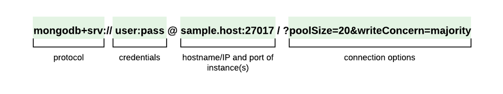

# MongoDB Node Driver  

Le pilote officiel MongoDB Node.js permet aux applications Node.js de se connecter à MongoDB et de travailler avec des données. Le pilote dispose d'une API asynchrone qui vous permet d'accéder aux valeurs de retour de méthode via Promises ou de spécifier des rappels pour y accéder lors de la communication avec MongoDB. (Traduction du [site officiel](https://docs.mongodb.com/drivers/node/current/))  

!!! manuel 
    [MongoDB sur GitHub](https://mongodb.github.io/node-mongodb-native/4.0/)  
    [Vidéo Youtube](https://www.youtube.com/watch?v=R4AEyKehpss)  
    [MongoDB et Promises](https://www.mongodb.com/docs/drivers/node/current/fundamentals/promises/)  
    [Driver Quickstart](https://www.mongodb.com/docs/drivers/node/current/quick-start/)  


## Étape 1 - Ajout du module mongodb  

1. Créez un nouveau projet Node  
2. L’initialiser  
3. Ajoutez le module mongodb :  

    ``` nodejsrepl title="console"
    npm install mongodb
    ```

4.  Importer le module dans le repo approprié : 

    ``` ts title="repo.ts"
    import { MongoClient } from 'mongodb';
    ```


## Étape 2 – Établissement de la connexion  

<figure markdown>
  { width="600" }
  <figcaption>Décortiquer une chaîne de connection MongoDB</figcaption>
</figure>

``` ts title="mongodb.ts"
// connexion distante
const uri = "mongodb+srv://sample-hostname:27017/?poolSize=20&writeConcern=majority";

// connexion locale
const uri = "mongodb://localhost:<port>"
```

## Étape 3 – Exécuter vos requêtes  

Exemple : Utilisation dans une application Node.js (sans Express)  

``` ts title="connexion.ts"
import { MongoClient } from "mongodb";
// Replace the uri string with your MongoDB deployment's connection string.
const uri = "mongodb+srv://<user>:<password>@<cluster-url>?retryWrites=true&writeConcern=majority";
const client = new MongoClient(uri);
async function run() {
  try {
    await client.connect();
    const database = client.db('sample_mflix');
    const movies = database.collection('movies');
    // Query for a movie that has the title 'Back to the Future'
    const query = { title: 'Back to the Future' };
    const movie = await movies.findOne(query);
    console.log(movie);
  } finally {
    // Ensures that the client will close when you finish/error
    await client.close();
  }
}
run().catch(console.dir);

```

## Exemples d'utilisation  

- [Exemples](https://docs.mongodb.com/drivers/node/current/usage-examples/)  
- [findOne](https://docs.mongodb.com/drivers/node/current/usage-examples/findOne/)  
- [find](https://docs.mongodb.com/drivers/node/current/usage-examples/find/)  
- [InsertOne](https://docs.mongodb.com/drivers/node/current/usage-examples/insertOne/)  
- [UpdateOne](https://docs.mongodb.com/drivers/node/current/usage-examples/updateOne/)  
- [DeleteOne](https://docs.mongodb.com/drivers/node/current/usage-examples/deleteOne/)  
- [Aggregation](https://docs.mongodb.com/drivers/node/current/fundamentals/aggregation/)  

## MongoDB cursor  

Lorsque la requête retourne plusieurs résultats, ceux-ci sont retournés dans un [curseur](https://docs.mongodb.com/drivers/node/fundamentals/crud/read-operations/cursor/)  

Les fonctions suivantes retournent un curseur :   

- Collection.find()	
- Collection.aggregate()	
- Collection.listIndexes()
- Db.listCollections()	 
- Db.aggregate()  
  
Voici deux façons de parcourir un curseur :   

=== "En implémentant l’interface AsyncIterator"  
    ``` ts title="asynciterator.ts"
    const cursor = collection.find({});
    console.log("async 1");

    for await (const doc of cursor) {
      console.log(doc);
    }
    console.log("async 2");
    ```
=== "En utilisant l’itération « manuelle »"  
    ``` ts title="manuelle.ts"
    const cursor = collection.find({});

    while (await cursor.hasNext()) {
      console.log(await cursor.next());
    }
    ```

La méthode toArray() permet d’obtenir un tableau à partir des documents d’un curseur. [Cursor.toArray()](https://docs.mongodb.com/manual/reference/method/cursor.toArray/)  

## Express et MongoDB Node Driver (HTML)

``` ts title="express.ts"
router.get('/', async (req, res) => {
        var html = '<h1>Liste des films</h1>'
        const client = new MongoClient(uri);
        try {
            await client.connect();
            const db = client.db('nom de la BD');
            const filmsCollection = db.collection('films');
    
            html += '<table>';   
        
            await filmsCollection.find({}).forEach(function(doc) {
                console.log(doc);
                html += '<tr>';        
                html += '<td>' + doc.titre + '</td>';           
                html += '<td>';        
                html += '<a href="/edit/' + doc._id + '">Modifier (à venir)</a>';        
                html += ' | ';        
                html += '<a href="/delete/' + doc._id + '">Supprimer (à venir)</a>';        
                html += '</td>';        
                html += '</tr>';  
            }); 
            
            html += '</table>';
        } finally {
            await client.close();
            res.send(html);
        }
    })

```

!!! manuel 
    [Node CRUD Tutorial](https://www.mongodb.com/developer/quickstart/node-crud-tutorial/)  


## Express et MongoDB Node Driver (json)  

``` ts title="express-json.ts"
router.get('/', async (req: IReq, res: IRes) => {  
  
  const client = new MongoClient(uri);
  try {
    await client.connect();
    const db = client.db('nom de la BD');
    const listeFilms = await db.collection('films').find({}).toArray();
    res.json(listeFilms);
  } catch(err) {
    console.log(err.message);
    res.status(500).json({erreur: "Une erreur est survenue, veuillez contacter votre administrateur"})
  } finally {
    await client.close();
  }
  
});

```

!!! note  
    Les bases de données utilisées dans cette leçon proviennent de [ce dépôt GitHub](https://github.com/neelabalan/mongodb-sample-dataset/tree/main)  