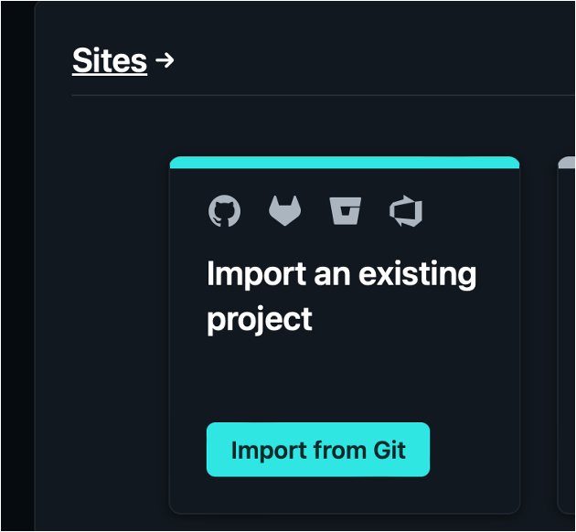
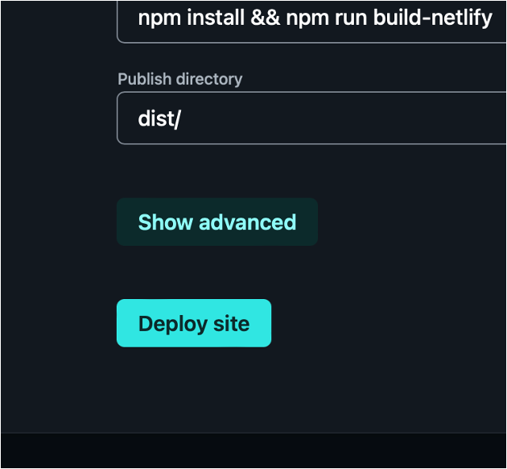
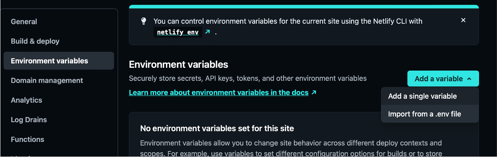
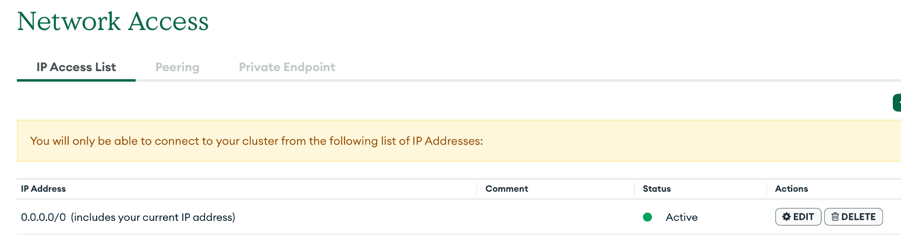
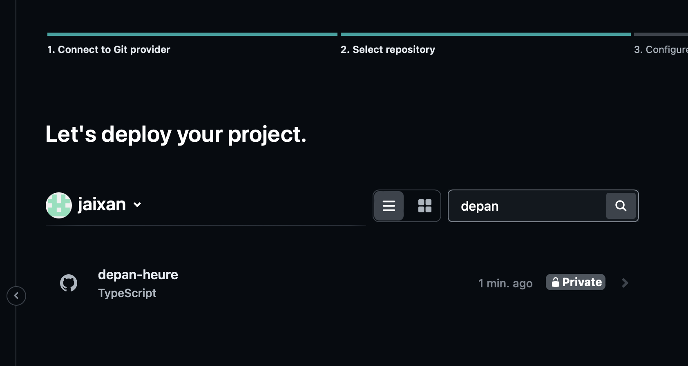
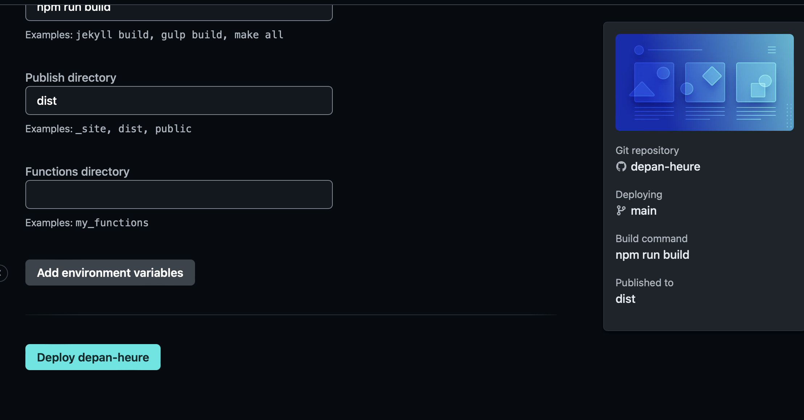
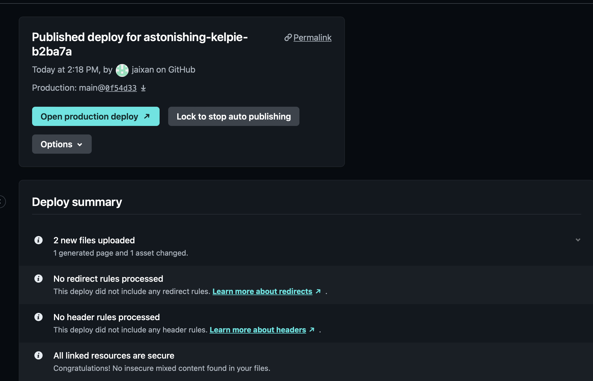

# Déploiements  

## Qu'est-ce que Netlify (CI/CD)

Netlify est une plateforme de déploiement web et d'hébergement de sites statiques. Elle permet aux développeurs de créer, déployer et gérer des sites web rapidement et facilement. Netlify simplifie le processus de déploiement en intégrant des fonctionnalités telles que le déploiement continu, l'intégration Git, les performances optimisées, la gestion des domaines et des certificats SSL, ainsi que d'autres outils de développement.  

Voici quelques caractéristiques clés de Netlify :  

- Déploiement continu : Netlify offre un déploiement automatique à chaque fois que vous poussez du code vers un référentiel Git. Cela signifie que dès que vous effectuez des modifications dans votre code source, votre site sera automatiquement reconstruit et déployé.  
- Hébergement statique : Netlify est principalement conçu pour les sites web statiques, ce qui signifie que vos fichiers HTML, CSS, JavaScript et autres médias sont préconstruits et livrés aux utilisateurs tels quels, sans nécessiter de traitement côté serveur.  
- Optimisation des performances : Netlify propose des fonctionnalités telles que la mise en cache globale, la compression des images et des fichiers, ainsi que la distribution de contenu via un réseau de diffusion de contenu (CDN), ce qui améliore la vitesse de chargement et l'expérience utilisateur.  
- Gestion des domaines et des certificats SSL : Netlify permet d'associer facilement des noms de domaine personnalisés à vos sites et fournit des certificats SSL gratuits pour assurer des connexions sécurisées.
Fonctionnalités de formulaire : Netlify propose également des fonctionnalités de formulaire qui vous permettent de gérer les soumissions de formulaires sans nécessiter d'application dorsale personnalisée.  
- Fonctions serverless : Netlify prend également en charge les fonctions serverless, ce qui vous permet d'ajouter des fonctionnalités dynamiques à votre site statique sans avoir à gérer une infrastructure serveur.
Intégrations tierces : Netlify peut être intégré à divers services tiers tels que GitHub, GitLab, Bitbucket, et d'autres outils de développement.  

En résumé, Netlify facilite le processus de création, de déploiement et de gestion de sites web statiques en offrant une gamme d'outils et de fonctionnalités pour les développeurs.

!!! manuel  
    [Documentation Netlify](https://docs.netlify.com)  


# Étapes de déploiement de l'application dorsale avec Netlify  

Netlify peut exécuter votre API node.js à l'aide de la fonctionnalité _serverless_.  Voici les étapes pour déployer votre *application dorsale*.  

1. installer les modules serverless-http et Netlify Functions :  

    ``` nodejsrepl title="console"
    npm i serverless-http @netlify/functions  
    ```

2. installer le module netlify-cli en dev :  

    ``` nodejsrepl title="console"
    npm i netlify-cli --save-dev
    ```

3. Décorer l’objet app avec un appel à serverless dans un nouveau fichier. Permet d’exposer vos routes à Netlify.  Mettre le nouveau fichier dans le dossier /functions (à la racine du projet).  

    ``` ts title="functions/api.ts"
    /**
     * Point d'entrée pour les fonctions de Netlify
     */

    import { app } from "../src/app";

    import dotenv from 'dotenv';

    import serverless from 'serverless-http';

    // *** Variables d'environnement ***

    dotenv.config();

    // *** Le handler requis par Netlify **
    export const handler = serverless(app);
    ```

4. Créer un fichier de configuration pour netlify  

    ``` json title="netlify.toml"  
    [build]
    command = "npm install && npm run build"
    functions = "functions"
    [functions]
    external_node_modules = ["express"]
    included_files=["./functions/database.json"]
    node_bundler = "esbuild"
    [[redirects]]
    force = true
    from = "/api/*"
    status = 200
    to = "/.netlify/functions/api/:splat"
    [[redirects]]
    force = true
    from = "/images/*"
    status = 200
    to = "/public/images/:splat"
    ```  

    Le redirects sert à recevoir les requêtes du style https://monbackend/api/x et le rediriger vers /.netlify functions/api/x (la façon interne de Netlify pour exposer les fonctions de l'application dorsale).  

5. Git push de votre projet et création du déploiement Netlify  

    <figure markdown>
    { width="600" }
    <figcaption>Dans Netlify, importer de git</figcaption>
    </figure>

    <figure markdown>
    { width="600" }
    <figcaption>Dans Netlify, déployer le site</figcaption>
    </figure>

5. Ajoutez vos variables d’environnement  
 
    <figure markdown>
    { width="600" }
    <figcaption>Dans Netlify, ajouter vos variables d'environnement</figcaption>
    </figure>


6. Si vous utilisez MongoDB Atlas, permettez la connection par n’importe quelle adresse IP  

    <figure markdown>
    { width="600" }
    <figcaption>Dans Atlas, permettez à 0.0.0.0 de se connecter</figcaption>
    </figure>  

## Procédures  

Veuillez consulter la procédure suivante pour plus d'informations sur le déploiement de la documentation API sur Netlify : [Rendre la documentation disponible pour l'api](documentation.md)

# Déploiement d'une application React  

1. Pousser votre site sur github.  

2. Dans netlify, choisissez votre dépôt github :  

    <figure markdown>
    { width="600" }
    <figcaption>choisissez votre dépôt github</figcaption>
    </figure>  

3. Dans netlify, déployez votre site :  

    <figure markdown>
    { width="600" }
    <figcaption>Déployez votre site</figcaption>
    </figure>  

4. Voir si le déploiement est réussi :  

    <figure markdown>
    { width="600" }
    <figcaption>Déploiement réussi</figcaption>
    </figure>  

