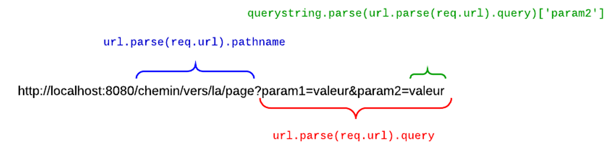

# Introduction à Node.js – Serveur Web  

## Étapes pour afficher une page web  (architecture client-serveur)  
1. Créer le serveur
2. Exécuter la commande node fichier.ts pour exécuter le code
    1. cmd
    2. cd “répertoire du serveur”
    3. node nomdufichieraexecuter.ts
3. Lancer le navigateur : http://localhost:####/ (#### : # du port sélectionné)

!!! manuel  
    [node.js - faire son premier serveur Web](https://nodejs.org/fr/docs/guides/getting-started-guide)  

!!! note  
    N'oubliez pas d'installer @types/node pour que TypeScript reconnaisse les modules standards nodejs.  


## Créer un serveur  

``` ts title="simple_serveur.ts"  
{!simple_server.ts!}
```

## URL / Paramètres  

<figure markdown>
  { width="600" }
  <figcaption>Comment extraire les parties d'un URL</figcaption>
</figure>


## URL  

Sans module, il faut _tout_ coder à la main (bas niveau!)  

``` ts title="serveur_sans_module.ts"
{!premier_serveur/premier_path.ts!}
```

## Paramètres  

Fonctionnement semblable pour les paramètres :  

``` ts title="serveur_sans_module.ts"  
{!premier_serveur/premier.ts!}
```

# Internationalisation – les devises  

``` ts title="format_devise.ts"
const formatter = new Intl.NumberFormat('fr-CA', 
    {
        style: 'currency',
        currency: 'CAD',
    }
);

const prix = 3.75;

console.log(`le prix est ${formatter.format(prix)}`);
```  

