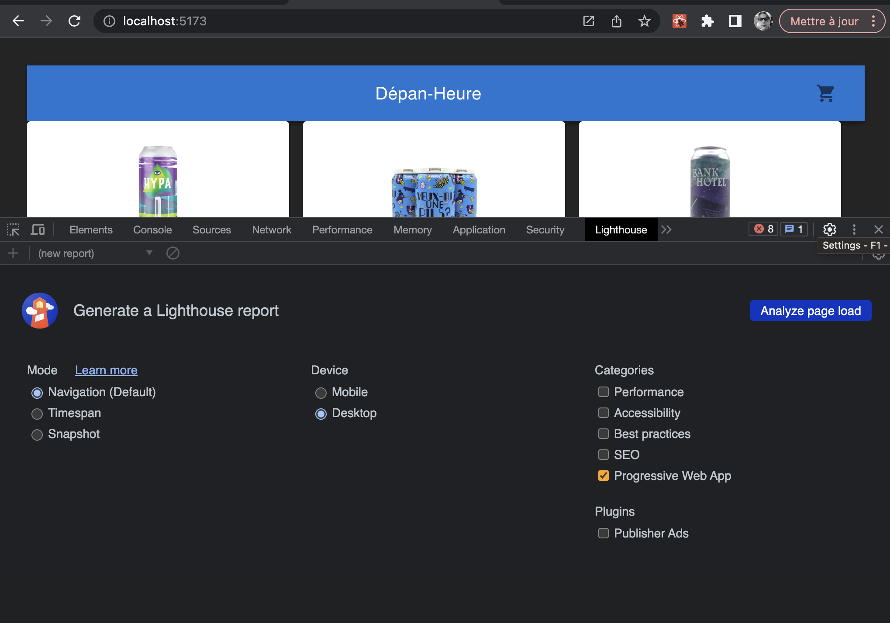
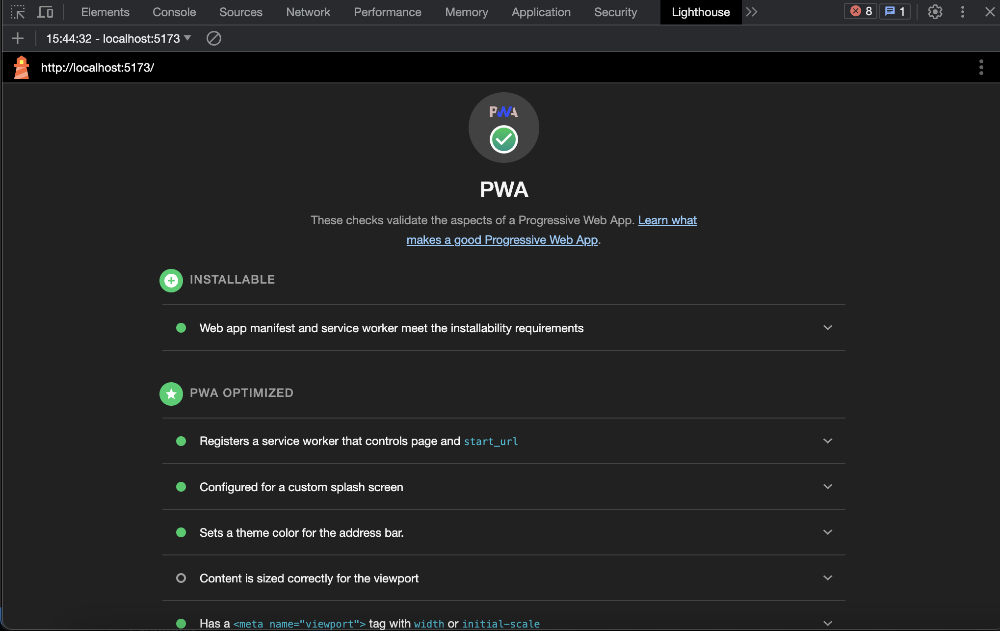

# Progressive Web Apps  

Les __applications web progressives__ (ou _progressive web applications_ en anglais, abrégées en PWAs) sont des applications web qui utilisent les _service workers_, les _manifestes_, et d'autres fonctionnalités de la plateforme web, avec _l'amélioration progressive_ pour fournir aux utilisatrices et utilisateurs une expérience équivalente à celle des applications natives.

!!! manuel  
    [MDN - Progressive Web Apps](https://developer.mozilla.org/fr/docs/Web/Progressive_web_apps)  
    [Stats et nouvelles sur PWA](https://www.pwastats.com/)  
    [Web.dev - Apprendre sur PWA](https://web.dev/learn/pwa/)  

# Utilisation du plugiciel PWA pour vite  

!!! manuel  
    [Guide pour le plugiciel PWA](https://vite-pwa-org.netlify.app/guide/)  

1. Installation du plugiciel  :

    ``` nodejsrepl title="console"
    npm install -D vite-plugin-pwa
    ```  

2. Modifier vite.config.ts pour générer le manifest requis pour PWA :  

    ``` ts title="vite.config.ts"
    import { defineConfig } from 'vite';
    import react from '@vitejs/plugin-react';
    import { VitePWA } from 'vite-plugin-pwa';

    // https://vitejs.dev/config/
    export default defineConfig({
    plugins: [
        react(),
        VitePWA({
        registerType: 'autoUpdate',
        devOptions: {
            enabled: true,
        },
        includeAssets: ['favicon.ico', 'logo192.png', 'vite.svg'],
        manifest: {
            name: 'Depan-Heure',
            short_name: 'dep',
            description: 'Le meilleur dépanneur en ligne',
            theme_color: '#ffffff',
            icons: [
            {
                src: 'logo192.png',
                sizes: '192x192',
                type: 'image/png',
                purpose: 'maskable',
            },
            {
                src: 'logo512.png',
                sizes: '512x512',
                type: 'image/png',
            },
            ],
        },
        }),
    ],
    });
    ```

3. Tester votre application avec Lighthouse :  

    <figure markdown>
    { width="600" }
    <figcaption>Utiliser Lighthouse dans les outils de développeur de Chrome</figcaption>
    </figure>

    Résultats attendus :  

    <figure markdown>
    { width="600" }
    <figcaption>Exemple de rapport Lighthouse</figcaption>
    </figure>

