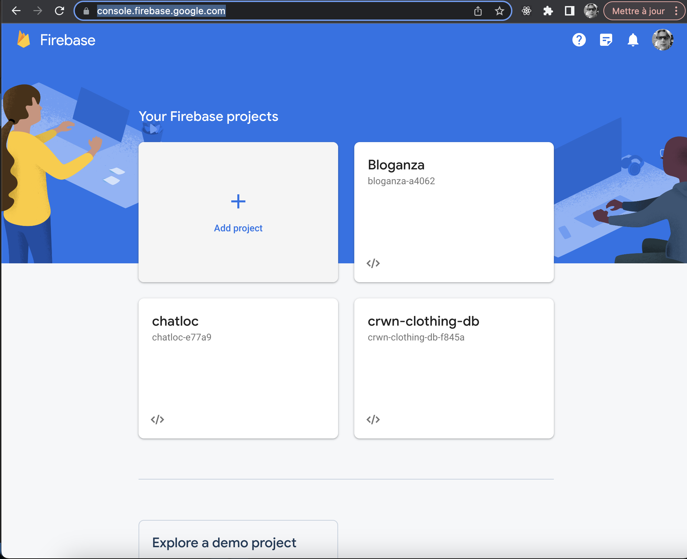
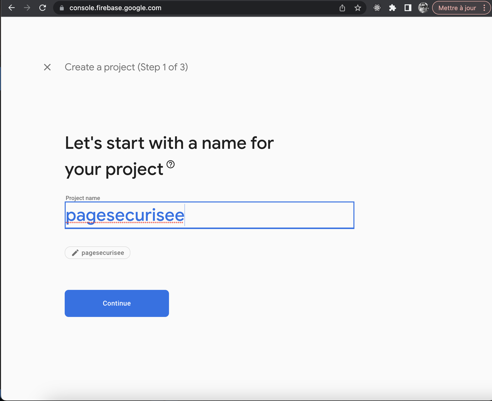
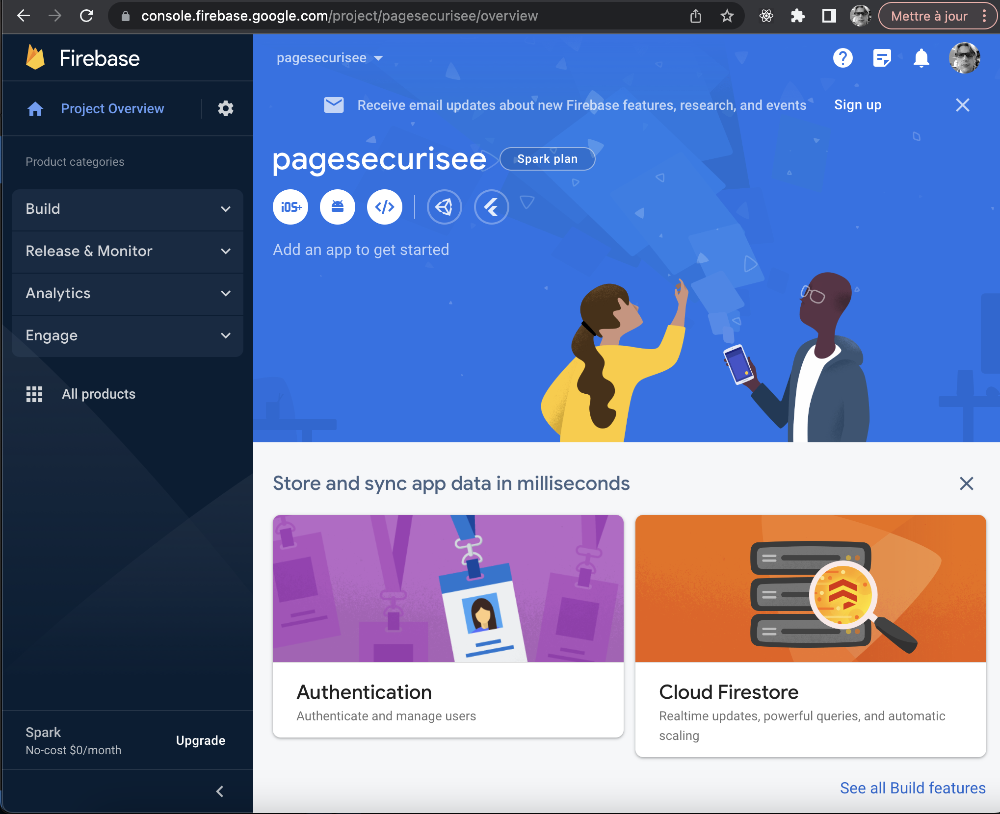
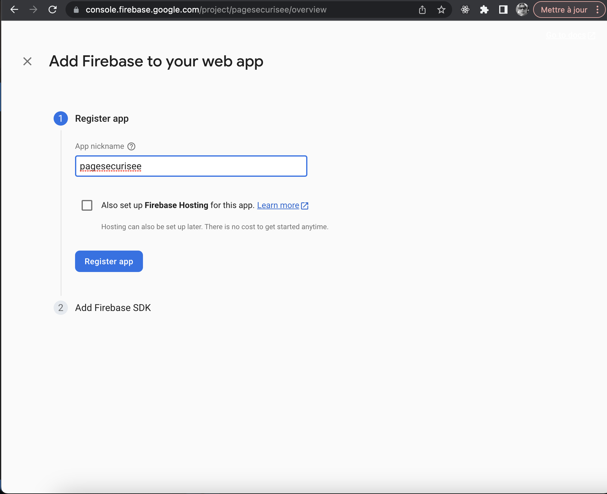
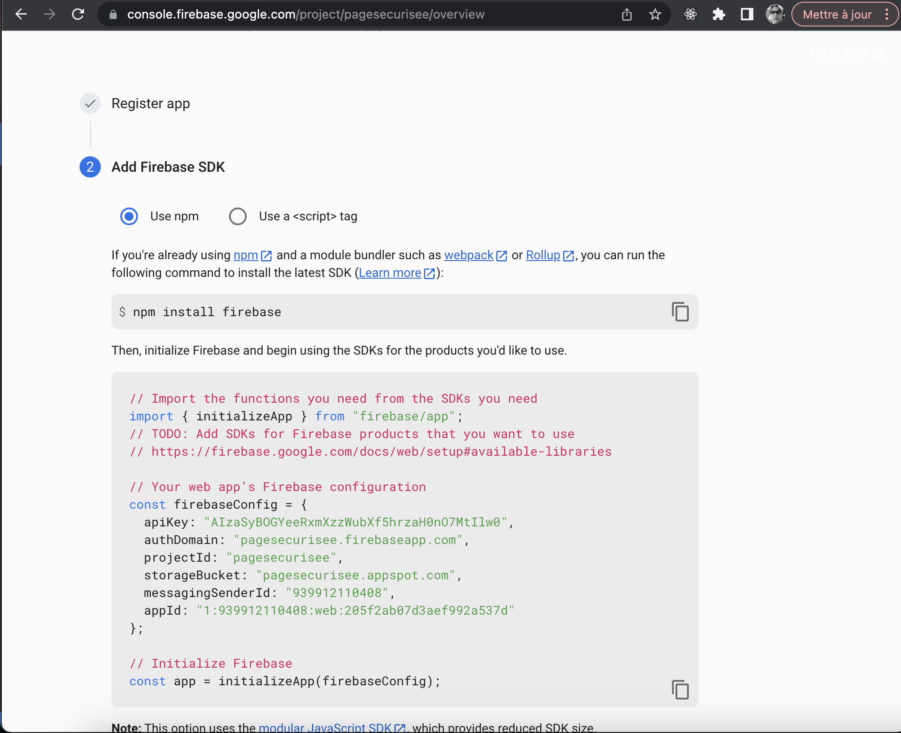
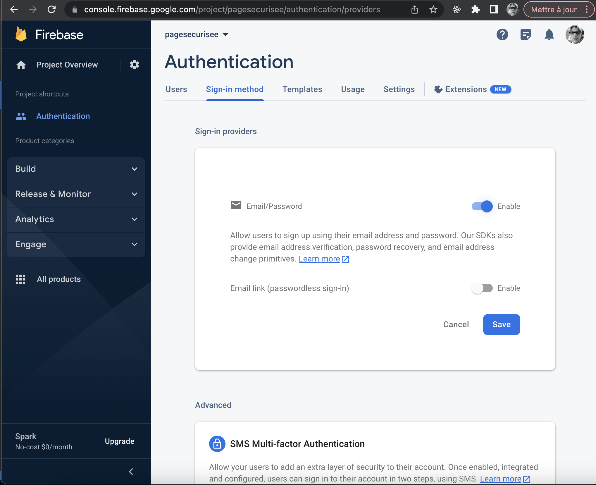
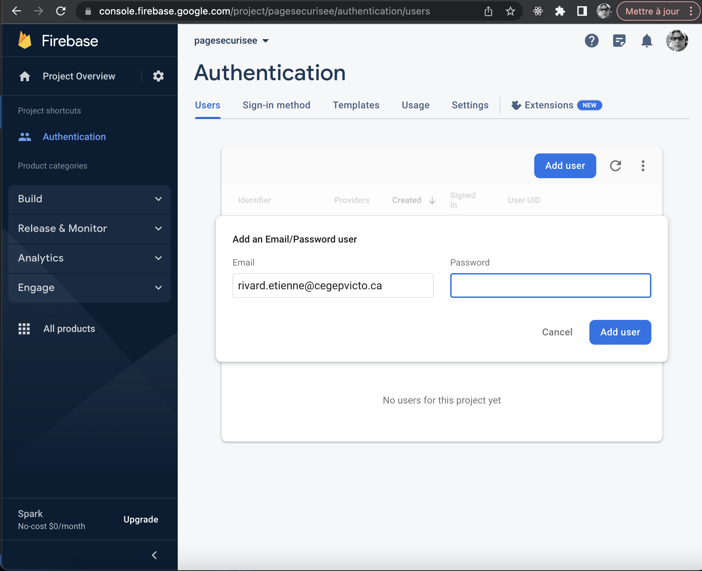
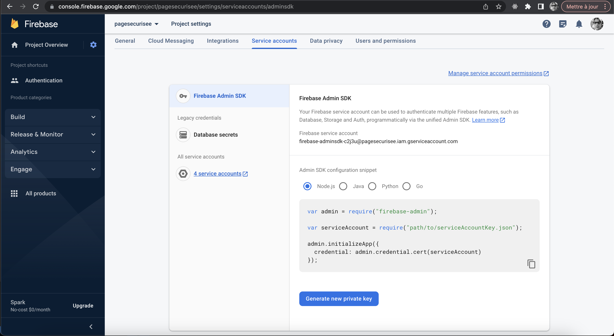
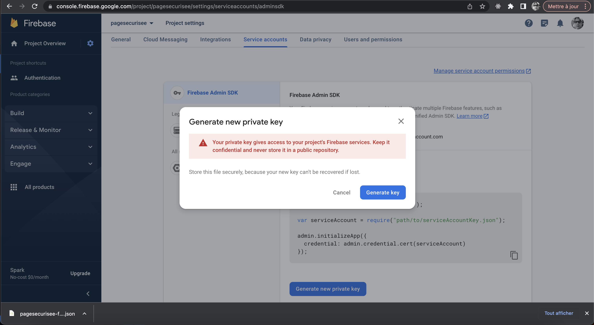

# Authentification  

L'authentification joue un rôle crucial dans la sécurité et la protection des données des utilisateurs, en vérifiant leur identité avant de leur accorder l'accès à des fonctionnalités restreintes.  Dans cette leçon, nous allons utiliser la plateforme populaire __Firebase__ de Google pour gérer notre authentification, autant dans l'application React que pour notre API.  

# Installation dans React  

1. Installer les modules pour Firebase dans React :  

    ``` nodejsrepl title="console"
    bun install firebase react-firebase-hooks
    ```  

2. Configurer Firebase :  

    Aller à la [console de Firebase](https://console.firebase.google.com/).  

    Ajouter un nouveau projet :  

    <figure markdown>
    { width="600" }
    <figcaption>Aouter un nouveau projet Firebase</figcaption>
    </figure>

    <figure markdown>
    { width="600" }
    <figcaption>Donner un nom au projet</figcaption>
    </figure>

    Ajouter une application :  

    <figure markdown>
    { width="600" }
    <figcaption>Cliquer sur le bouton Web</figcaption>
    </figure>

    <figure markdown>
    { width="600" }
    <figcaption>Nommer l'application</figcaption>
    </figure>

    <figure markdown>
    { width="600" }
    <figcaption>Générer le code JavaScript pour votre application</figcaption>
    </figure>

    Configurer l'authentification par courriel/mot de passe :  


    <figure markdown>
    { width="600" }
    <figcaption>Ajouter l'authentification par utilisateur/mot de passe</figcaption>
    </figure>

    <figure markdown>
    { width="600" }
    <figcaption>Activerl'authentification par utilisateur/mot de passe</figcaption>
    </figure>

    Ajouter un utilisateur :  

    <figure markdown>
    { width="600" }
    <figcaption>Ajouter un utilisateur/mot de passe</figcaption>
    </figure>

3. Créer le fichier firebase.ts :  

    ``` ts title="firebase.ts"
    import { initializeApp } from 'firebase/app';
    import { getAuth, signInWithEmailAndPassword, signOut } from 'firebase/auth';

    const firebaseConfig = {
    apiKey: '',
    authDomain: '',
    projectId: '',
    storageBucket: '',
    messagingSenderId: '',
    appId: '',
    };

    // Initialize Firebase
    const app = initializeApp(firebaseConfig);
    export const auth = getAuth(app);

    export const logInWithEmailAndPassword = async (
    email: string,
    password: string
    ) => {
    try {
        await signInWithEmailAndPassword(auth, email, password);
    } catch (err: any) {
        console.error(err);
        alert(err.message);
    }
    };
    ```

3. Créer une page de login  

    ``` ts title="routes/login.route.tsx"
    /**
     * Basé sur le modèle de Material UI 
     * https://github.com/mui/material-ui/tree/v5.14.4/docs/data/material/getting-started/templates/sign-in
     **/
    import { useEffect } from 'react';
    import { useNavigate } from 'react-router-dom';
    import { auth, logInWithEmailAndPassword } from '../firebase';
    import { useAuthState } from 'react-firebase-hooks/auth';

    import { createTheme, ThemeProvider } from '@mui/material/styles';
    import Avatar from '@mui/material/Avatar';
    import Button from '@mui/material/Button';
    import CssBaseline from '@mui/material/CssBaseline';
    import TextField from '@mui/material/TextField';
    import Paper from '@mui/material/Paper';
    import Box from '@mui/material/Box';
    import Grid from '@mui/material/Grid';
    import LockOutlinedIcon from '@mui/icons-material/LockOutlined';
    import Typography from '@mui/material/Typography';

    function Copyright(props: any) {
    return (
        <Typography
        variant="body2"
        color="text.secondary"
        align="center"
        {...props}
        >
        {'Copyright © '}
        Etienne Rivard {new Date().getFullYear()}
        {'.'}
        </Typography>
    );
    }

    const defaultTheme = createTheme();

    function Login() {
    const [user, loading] = useAuthState(auth);
    const navigate = useNavigate();

    useEffect(() => {
        if (loading) {
        // maybe trigger a loading screen
        return;
        }
        if (user) navigate('/');
        // eslint-disable-next-line react-hooks/exhaustive-deps
    }, [user, loading]);

    const handleSubmit = (event: React.FormEvent<HTMLFormElement>) => {
        event.preventDefault();
        const data = new FormData(event.currentTarget);
        logInWithEmailAndPassword(
        data.get('email') as string,
        data.get('password') as string
        );
    };

    return (
        <ThemeProvider theme={defaultTheme}>
        <Grid container component="main" sx={{ height: '87vh', width: '90vw' }}>
            <CssBaseline />
            <Grid
            item
            xs={false}
            sm={4}
            md={7}
            sx={{
                backgroundImage:
                'url(https://source.unsplash.com/random?wallpapers)',
                backgroundRepeat: 'no-repeat',
                backgroundColor: (t) =>
                t.palette.mode === 'light'
                    ? t.palette.grey[50]
                    : t.palette.grey[900],
                backgroundSize: 'cover',
                backgroundPosition: 'center',
            }}
            />
            <Grid item xs={12} sm={8} md={5} component={Paper} elevation={6} square>
            <Box
                sx={{
                my: 8,
                mx: 4,
                display: 'flex',
                flexDirection: 'column',
                alignItems: 'center',
                }}
            >
                <Avatar sx={{ m: 1, bgcolor: 'secondary.main' }}>
                <LockOutlinedIcon />
                </Avatar>
                <Typography component="h1" variant="h5">
                "S'authentifier à X"
                </Typography>
                <Box
                component="form"
                noValidate
                onSubmit={handleSubmit}
                sx={{ mt: 1 }}
                >
                <TextField
                    margin="normal"
                    required
                    fullWidth
                    id="email"
                    label="courriel"
                    name="email"
                    autoComplete="email"
                    autoFocus
                />
                <TextField
                    margin="normal"
                    required
                    fullWidth
                    name="password"
                    label="mot de passe"
                    type="password"
                    id="password"
                    autoComplete="current-password"
                />
                <Button
                    type="submit"
                    fullWidth
                    variant="contained"
                    sx={{ mt: 3, mb: 2 }}
                >
                    S'authentifier
                </Button>
                <Copyright sx={{ mt: 5 }} />
                </Box>
            </Box>
            </Grid>
        </Grid>
        </ThemeProvider>
    );
    }
    export default Login;
    ```

4. Rediriger vers la page de login si l'utilisateur n'est pas authentifié :  

    ``` ts title="routes/home.route.tsx"
    import { Home } from '../components/home.component';
    import { useEffect } from 'react';
    import { useAuthState } from 'react-firebase-hooks/auth';
    import { useNavigate } from 'react-router-dom';
    import { auth } from '../firebase';

    export const HomeRoute = () => {
    const [user, loading] = useAuthState(auth);
    const navigate = useNavigate();

    useEffect(() => {
        // si loading = true, ça veut dire que le firebase n'est pas encore prêt.
        if (loading) return;
        // si user est null, l'utilisateur n'est pas authentifié
        if (!user) navigate('/login');
        // eslint-disable-next-line react-hooks/exhaustive-deps
    }, [user, loading]);

    return <Home />;
    };
    ```

!!! codesandbox "CodeSandbox"  
    [Démo - Page Login](https://codesandbox.io/p/sandbox/github/jaixan/developpementweb3/tree/main/code/pagelogin)  


# Installation dans un API  

Firebase peut créer des jetons dans l'application React qui servent à valider l'utilisateur dans votre API.  


1. Installer le module Firebase Admin à votre API :  

    ``` nodejsrepl title="console"
    bun install firebase-admin
    ```

2. Générer firebase.json à partir de la console Firebase :  

    <figure markdown>
    { width="600" }
    <figcaption>Dans la configuration du projet, aller à l'onglet Service Accounts</figcaption>
    </figure>

    <figure markdown>
    { width="600" }
    <figcaption>Générer une clé</figcaption>
    </figure>


    __Le fichier généré donne un accès administratif à votre projet. Ne pas le mettre dans votre github!__ 

4. Coder un intergiciel pour protéger vos routes :  

    ``` ts title="authentificationFirebase.ts"
    import admin from 'firebase-admin';
    import express, { Express, Request, Response, NextFunction } from 'express';

    var serviceAccount = require('../firebase.json');

    admin.initializeApp({
    credential: admin.credential.cert(serviceAccount),
    });

    export const firebaseAuthentication = async (
    req: Request,
    res: Response,
    next: NextFunction
    ) => {
    const authHeader = req.headers.authorization;
    console.log('start firebaseAuthentication');
    if (authHeader) {
        const idToken = authHeader.split(' ')[1];
        console.log('idToken:', idToken);
        admin
        .auth()
        .verifyIdToken(idToken)
        .then(function (decodedToken) {
            console.log('Next()');
            next();
        })
        .catch(function (error) {
            console.log('catch Error:', error);
            const errorMessage = {
            status: 403,
            error: error,
            };
            res.sendStatus(403).send(errorMessage);
            res.end();
        });
    } else {
        console.log('no header');
        const errorMessage = {
        status: 401,
        error: 'Missing authorization header',
        };
        res.sendStatus(401);
        res.end();
    }
    };      
    ```

5. Dans votre application React, générer le jeton :  

    ``` ts title="firebase.ts"
    export const getToken = async () => {
    if (!auth.currentUser) return '';

    return await auth.currentUser
        .getIdToken(false)
        .then(function (idToken) {
        return idToken;
        })
        .catch(function (error) {
        console.log(error);
        return null;
        });
    };
    ```

6. Dans votre application React, envoyer le jeton dans l'appel de votre API :  

    ``` ts title="api.ts"
    const token = await getToken();
    const config = {
        headers: { Authorization: `Bearer ${token}` },
    };
    const response = await axios
        .get('/api/embeddings/logs', config)
        .catch((reason) => console.log(reason));
    ```


  