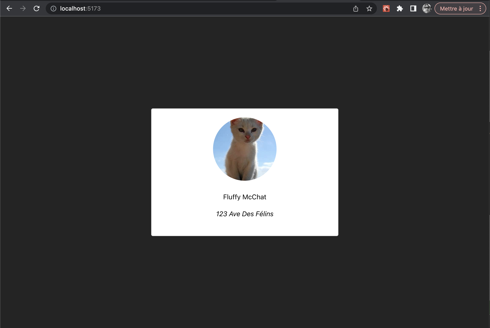
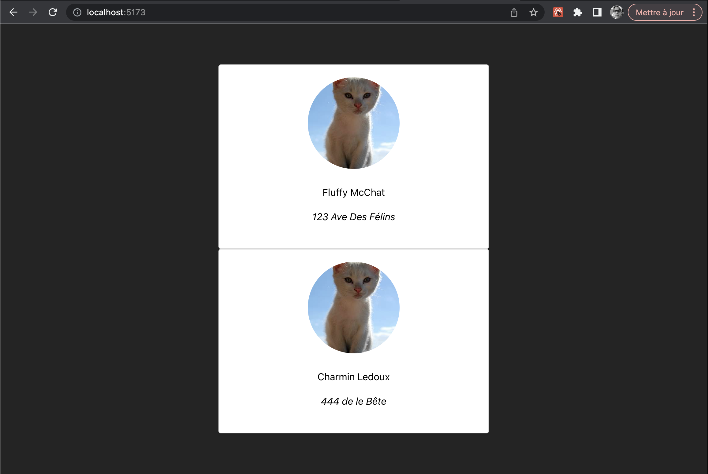

# React  

## Générer un projet en React  

Il y a plusieurs Générateur d’applications React qui permettent de générer la structure de base recommandée en JavaScript ou TypeScript. 

Voici comment générer l’application :  

1. Situez vous dans le dossier où vous désirez créer l’application (le dossier de l’application sera automatiquement créé à la prochaine étape)  
1. Exécutez la commande de création d’application :  
    ``` nodejsrepl title="console"
    bun create vite@latest my_app
    ```
1. Suivez les instructions et choisir __React__ et __TypeScript__  
1. Une fois l’application générée, déplacez-vous dans le dossier créé :  
    ``` nodejsrepl title="console"
    cd my_app
    ```
1. Exécutez l’application en utilisant les commandes suivantes :  
    ``` nodejsrepl title="console"
    bun install
    bun run dev
    ```

<figure markdown>
  { width="600" }
  <figcaption>Page par défaut d'une application Vite en React</figcaption>
</figure>

!!! manuel 
    [Documentation officielle Vite](https://vitejs.dev/guide/)  


# React Developer Tools  

React Developer Tools est un plugin dans Chrome pour aider au débogage de vos applications React.  

Pour l'installer :  [React Developer Tools pour Chrome](https://chrome.google.com/webstore/detail/react-developer-tools/fmkadmapgofadopljbjfkapdkoienihi)  

<figure markdown>
  { width="600" }
  <figcaption>React Development Tools s'installe dans les outils de développement de Chrome</figcaption>
</figure>


# Programmer React avec des fonctions  

Utiliser des fonctions au lieu des classes en React est la manière officielle de programmer dans cet environnement.  

``` ts title="personnage.component.tsx"
{!personnage_base/src/components/personnage.component.tsx!}
```

``` ts title="app.tsx"
{!personnage_base/src/App.tsx!}
```

<figure markdown>
  { width="600" }
  <figcaption>Affichage du projet personnage - base</figcaption>
</figure>

!!! codesandbox "CodeSandbox"  
    [Démo - Personnage - Base](https://codesandbox.io/p/sandbox/github/jaixan/developpementweb3/tree/main/code/personnage_base)  

!!! manuel 
    [Learn React](https://react.dev/learn)  

# Passage de paramètres avec les props  

1. Définir la liste des paramètres dans une interface  
2. L’ajouter comme props à la fonction de la composante  
3. Utiliser les paramètres lors de l’instanciation de la composante  


``` ts title="personnage.component.tsx"
{!personnage_base_props/src/components/personnage.component.tsx!}
```

``` ts title="app.tsx"
{!personnage_base_props/src/App.tsx!}
```

<figure markdown>
  { width="600" }
  <figcaption>Affichage du projet personnage - base avec props</figcaption>
</figure>

!!! codesandbox "CodeSandbox"  
    [Démo - Personnage - Props](https://codesandbox.io/p/sandbox/github/jaixan/developpementweb3/tree/main/code/personnage_base_props)  

!!! manuel 
    [Props](https://react.dev/learn/passing-props-to-a-component)  


# Les hooks - useState  

- Conserve l’état d’une variable  
- Réagit lorsque la valeur change  

``` ts title="app.tsx"
{!personnage_base_useState/src/App.tsx!}
```

<figure markdown>
  { width="600" }
  <figcaption>Affichage du projet personnage - base avec useState</figcaption>
</figure>

!!! codesandbox "CodeSandbox"  
    [Démo - Personnage - useState](https://codesandbox.io/p/sandbox/github/jaixan/developpementweb3/tree/main/code/personnage_base_useState)  

!!! manuel 
    [useState](https://react.dev/reference/react/useState)  


# Hooks : useEffect  

Faire des traitements de données seulement lors d’événements précis, comme le premier render ou lors de changement d’une autre variable.  


``` ts title="app.tsx"
{!personnage_base_useEffect/src/App.tsx!}
```

<figure markdown>
  { width="600" }
  <figcaption>Affichage du projet personnage - base avec useEffect</figcaption>
</figure>

!!! codesandbox "CodeSandbox"    
    [Démo - Personnage - useEffect](https://codesandbox.io/p/sandbox/github/jaixan/developpementweb3/tree/main/code/personnage_base_useEffect)  

!!! manuel 
    [useEffect](https://react.dev/reference/react/useEffect)  


