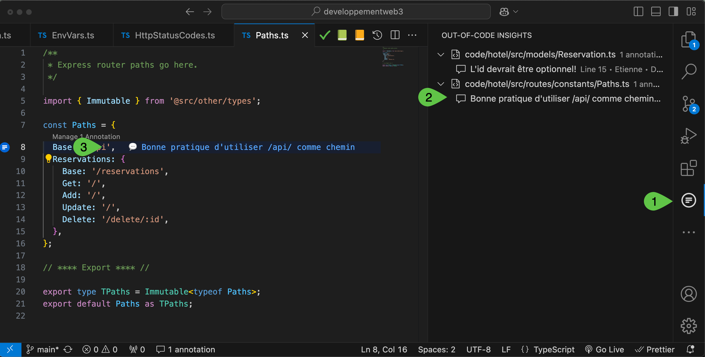

# Rétroaction dans le code

Le code source de votre projet sera annoté avec des commentaires pour vous donner des pistes d'amélioration. Pour ce faire, un plugin nommé `out-of-code insights` sera utilisé. Ce plugin permet d'ajouter des commentaires sans modifier le code source. 

## Installation du plugin

Installez le plugin en allant sur le [marché de Visual Studio Code](https://marketplace.visualstudio.com/items?itemName=JacquesGariepy.out-of-code-insights) et en cliquant sur le bouton `Install`.

## Utilisation

  

1. Ouvrir le panneau `Out-of-code insights` en cliquant sur l'icône de l'extension dans la barre latérale.

2. Toutes les annotations sont dans le panneau.

3. Vous pouvez voir chaque annotation dans le code, en utilisant le plugin `code lens` de Visual Studio Code.

